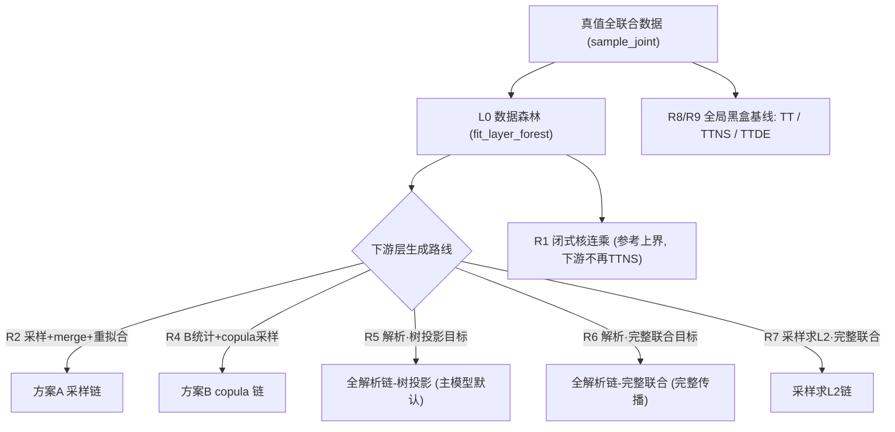
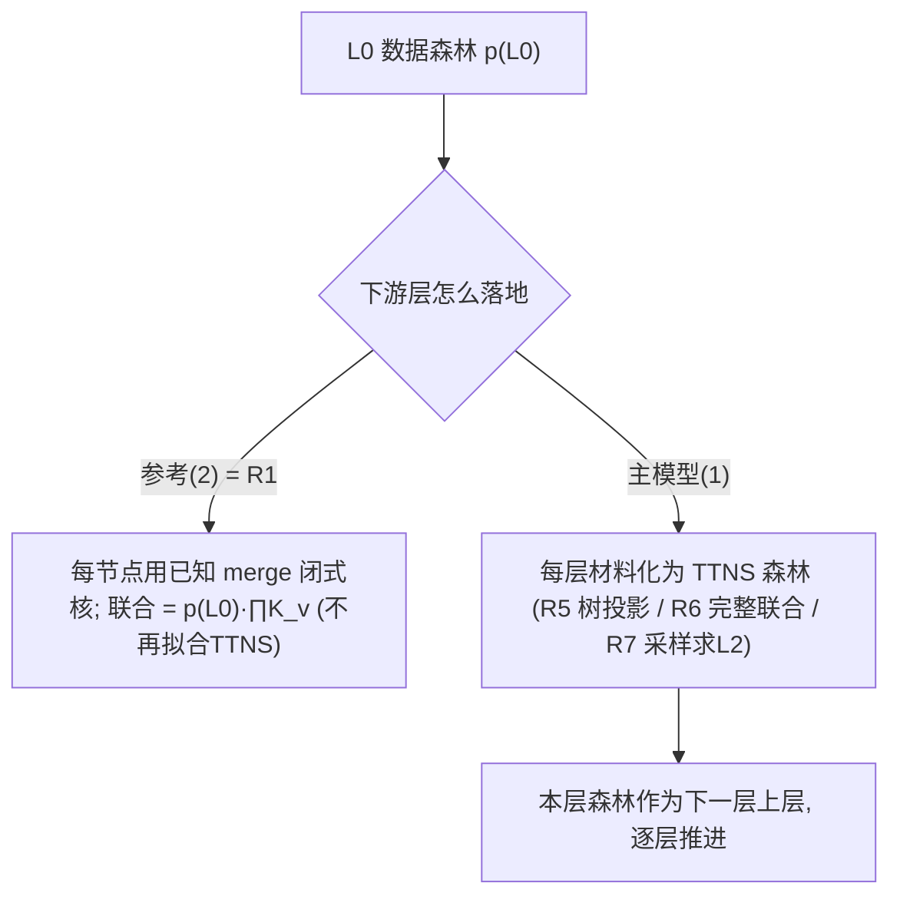
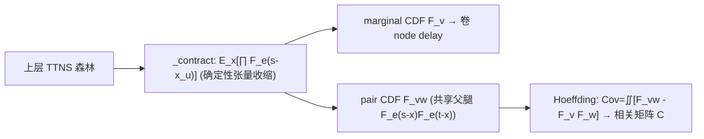
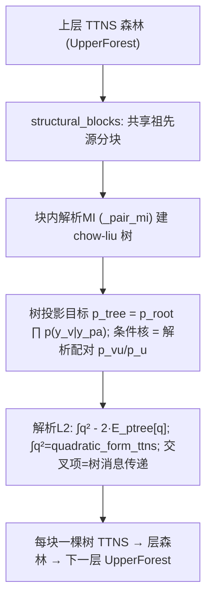
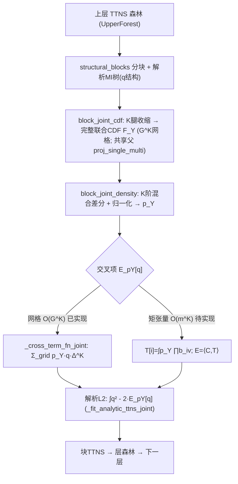
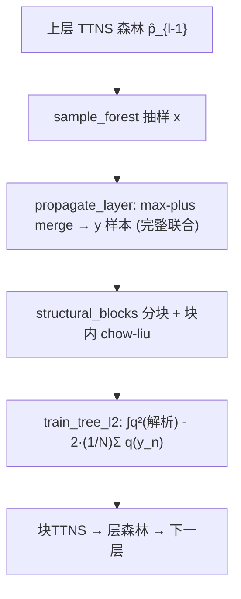
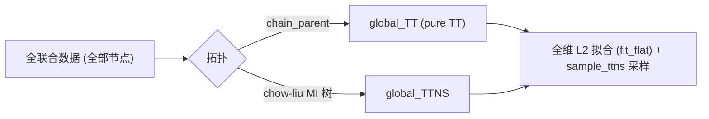
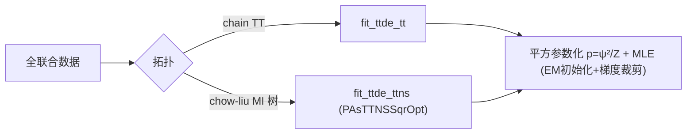

# ALGORITHM_zh.md — 多层 DAG × TTNS 算法交接总纲

> **定位**：这是"读完即可接手"的**算法总纲**，覆盖当前多层 DAG × TTNS 主线的架构、算法、公式、关键文件、复现命令、已验证结论与负结果、未决方向。
> **与其它文档的关系**：`Program.md`（人维护，含早期单层 TTNS 算子/测试细节，截至 2026-06-27，多层部分已过时）；`prompt_phase2.md`（agent 维护的流水账 checklist）；`simple_ttns_l2/reports/*`（逐实验报告）。本文件是它们的**统一入口**。
> **语言/公式规则**：正文中文；公式用 `$` 定界；标识符/命令/路径保持英文。

---

## 0. 一句话概述

在**已知结构的多层 DAG** 上做高维密度近似。**模型定义（用户定型）**：

1. **每一层内部都表示为一个单父 TTNS 森林**（层内按相关性/MI 分块、每块一棵 chow-liu 树 TTNS）——不仅是源层 $L_0$，**所有下游层也都是 TTNS**。
2. **层与层之间用「随机变量层间传递 merge」连接**：下层每个节点由其若干上层父节点经 merge 规则合并生成。
3. **逐层构建下游层**：对每个下游层，**先**按 DAG 拓扑 + MI/相关信息**构建该层的 TTNS 结构**（分块 + 每块 chow-liu 树），**再**用层间传递 merge 的**解析表达优化**这个结构（全程无采样，CDF 域解析，见 clarify.md / §3.4）。

核心结论：**结构感知的分层 TTNS 远优于把全联合硬拟合的全局 TT / 全局 TTNS / 全局 TTDE**（参数少数量级，joint_LL / 边缘 / 相关全面领先）。

> **术语约定**：此前称「max-plus 核 / max-plus 传播」，现统一命名为 **层间传递 merge**（随机变量层间合并）。合并规则见 §1.2。代码实现文件仍以 `maxplus_*` 命名（未改名，仅文档术语更新）。

---

## 0.1 算法路线总览（含总流程图）

所有路线共享同一个骨架：**真值数据 → 拟合 $L_0$ 数据森林 → 逐层向下生成下游层**（以及并列的全局黑盒基线）。各路线的差异只在两点：**(a) 下游层的拟合目标口径**（树投影 / 完整联合 / 已知闭式核）与 **(b) 传播方式**（确定性解析收缩 / 采样）。



| 路线 | 入口代码 | 目标/口径 | 传播方式 | 复杂度 | 定位 / 结论 |
|---|---|---|---|---|---|
| **R1** 闭式核连乘 | `maxplus_cond_logdensity` / `fit_layered_vs_flat_tt` | 完整联合(已知核) | 闭式条件核 | 廉价 | 分层因子化**性能上界**；下游不是 TTNS，仅参考(§2.3(2)) |
| **R2** 方案A 采样链 | `propagate_layer`+`fit_layer_forest` | 完整联合(样本) | 采样+merge | $O(NK)$ | 成链稳(结构再生抗累积)，有 MC 噪声(§3.1) |
| **R3** 方案B 单步解析 | `maxplus_cdf(_forest)` | 边缘/配对统计 | 确定性收缩 | $O(G^2)$ | 单步统计最准 / 诊断用(§3.2) |
| **R4** 方案B copula 链 | `sample_layer_copula` | 边缘+全相关(高斯copula) | 收缩+copula 采样 | $O(G^2)$+采样 | 保 pairwise，高斯近似(§3.3) |
| **R5** 全解析链-树投影 | `fit_analytic_chain` | **树投影 $p_{tree}$** | 确定性收缩 | $O(G^2)$ | ★主模型默认；深层 LL 稳、corr 差(§3.4) |
| **R6** 全解析链-完整联合 | `analytic_block_target_joint`+`_fit_analytic_ttns_joint` | **完整联合 $p_Y$** | 确定性收缩 | $O(G^K)$；矩张量 $O(m^K)$ | corr 好 + 无 MC 累积，但维度灾难(§3.5) |
| **R7** 采样求 L2 链 | `fit_sampled_chain` | **完整联合(样本)** | 采样+merge | $O(NK)$ | corr 好、可扩大块，深层 LL 略降(§3.6) |
| **R8** 全局 TT / TTNS | `fit_flat` | 全联合(线性 L2 黑盒) | — | 大 | 基线，远逊分层(§4/§6.1) |
| **R9** 全局 TTDE | `fit_ttde_tt` / `fit_ttde_ttns` | 全联合(平方 MLE 黑盒) | — | 大 | 最强全局黑盒基线(§6.5) |

> 记号：$K$=块内节点数，$G$=解析网格每维点数，$m$=每维 spline 基数，$N$=采样数。**R5–R7 是同一"每层单父 TTNS 森林"模型的三种拟合落地**（结构相同，只差目标口径与传播方式）；下面 §3 逐条给出流程图与算法说明。

---

## 1. 数据模型（真值生成过程）

### 1.1 多层 DAG 拓扑

- `MultiLayerSpec`（`simple_ttns_l2/dag_pipeline.py`）：节点分层 `layers`，有向边 `edges`（父在更上层）。
- `build_layered_spec(layer_sizes, fanin, wrap)`：banded 多父阶梯图——下层每个节点连上层 `fanin` 个相邻父，`wrap=True` 成环。相邻子节点**共享父** → 层内产生大量短环（树不可完全表达）。

### 1.2 层间传递 merge（随机变量层间合并，已知规则）

节点 $v$ 由其父集 $\mathrm{pa}(v)$（都在上一层）经 **merge 规则**合并生成：
$$x_v=\operatorname{merge}_{u\in\mathrm{pa}(v)}(x_u)=\max_{u\in\mathrm{pa}(v)}\big(x_u+e_{uv}\big)+d_v,\qquad e_{uv}\sim U[\text{edge\_lo},\text{edge\_hi}],\ d_v\sim U[\text{node\_lo},\text{node\_hi}]$$
- 「层间传递 merge」= 把上层若干随机变量 $\{x_u\}$ 合并成下层变量 $x_v$（含 edge delay $e$、node delay $d$，均已知、独立、连续均匀）。参数见 `DelayParams`（`simple_ttns_l2/maxplus_pipeline.py`）。
- 源层 $L_0$ 无父，由**源分布**生成（默认 $U[\text{src\_lo},\text{src\_hi}]$；复杂实验可换双峰/异质多峰等）。

> 名称对照：本操作即此前文档/代码中的「max-plus 聚合」；现统一称 **层间传递 merge**。

### 1.3 采样真值全联合

- `ground_truth_samplers(spec, params)` → `(sources, kernels)`；`dag_pipeline.sample_joint(spec, sources, kernels, key, n)` 按拓扑序逐层前向采样，返回 `[n, n_nodes]`（列 = 节点 id）。
- 复杂源示例：`compare_global_vs_layered_plot.bimodal_sources`（$0.5\,\mathcal N(0.25,\sigma)+0.5\,\mathcal N(0.85,\sigma)$）。

---

## 2. 模型：每层单父 TTNS 森林 + 层间传递 merge

> **硬约束（用户定型）**：模型侧**只用单父 TTNS**（已淘汰早期多父 core `dag_ttns.py`）；**每一层（含所有下游层）都表示为一个单父 TTNS 森林**；层与层之间用**层间传递 merge**连接。

### 2.1 单父 TTNS 与 L2 目标

- `TTNSOpt`（`TTNSDE/ttde/ttns/ttns_opt.py`）：仅含 cores，拓扑由 `parent: Sequence[int]` 传入（单父树）。
- 线性未归一化密度 $q_\theta(x)=\langle T_\theta,\ \bigotimes_k b_k(x_k)\rangle$，基为 B 样条 `SplineOnKnots`（`build_bases(x, q, m)`，`train_l2.py`）。
- L2 目标 $L(\theta)=\int q_\theta^2 - 2\,\mathbb{E}_{\text{data}}[q_\theta]$（`simple_ttns_l2/objective.py`、训练器 `experiments/fit_diamond_dag_vs_tree.train_tree_l2`，含 `grad_clip`、`train_noise`、早停、逐步积分归一化）。

### 2.2 层内分块森林

`simple_ttns_l2/layered_forest.py`：
- `layer_blocks(samples, mi_threshold)`：层内两两互信息（MI）阈值化建图 → 连通分量 = **互不相关的块**；块间近似独立 → 层密度 = 块密度乘积。
- `fit_layer_forest(...)`：每块用 chow-liu（`chow_liu.estimate_chow_liu_tree`）定树拓扑 + `train_tree_l2` 拟合 → 返回 `List[BlockModel]`（森林）。
- `forest_log_density`：层对数密度 = $\sum_\text{block}\log q_\text{block}$。
- `sample_forest`：各块用 `ttns_sampler.sample_ttns`（条件 inverse-CDF）采样后按列拼回。

### 2.3 整链的两种「落地方式」

模型是「每层 TTNS 森林 + 层间传递 merge」。下游层具体怎么得到，有两种实现，含义不同：

**(1) 全解析链（★ 主模型，符合用户定义：每层都是 TTNS）**
每个下游层都**材料化为一个 TTNS 森林**：先按 DAG 拓扑 + MI/相关构建结构，再用 merge 的解析表达（CDF 域）优化。上层 TTNS → 下层 TTNS，逐层推进，**全程无采样**。
代码：`analytic_tree_fit.fit_analytic_chain`（详见 §3.4）。适合"我们要的就是每层 TTNS 森林"的场景。

**(2) 闭式核连乘（参考 / 上界，不把下游层再材料化）**
只学源层森林 $p_{\text{forest}}(L_0)$，下游层**直接**用 merge 的已知闭式条件核连乘，不再拟合 TTNS：
$$p(x)=p_{\text{forest}}(L_0)\cdot\prod_{l\ge1}\prod_{v\in L_l}K_v\big(x_v\mid\mathrm{pa}(v)\big)$$
$K_v$ 为 merge 条件核的闭式对数密度（`layered_forest.maxplus_cond_logdensity`）：
$$F_M(s)=\prod_{u}F_e(s-x_u),\quad K_v(y)=\frac{F_M(y-\text{node\_lo})-F_M(y-\text{node\_hi})}{\text{node\_hi}-\text{node\_lo}}.$$
这种方式能直接给出**完整联合密度**，是分层因子化的**性能上界**（用于证明"结构化 ≫ 全局黑盒"，见 §6.4）；但它不满足"下游层也是 TTNS"，只作参考基线。

> 区别小结：主模型(1) 把每层都做成 TTNS（结构纯粹、但每层材料化有树宽损失）；参考(2) 用闭式核直连（联合最准、但下游层不是 TTNS）。

**两种落地方式流程图（R1 参考 vs (1) 材料化为 TTNS 的多路线）**：



---

## 3. 传播算法（把上层推进到下层）

三种"生成下一层"的方式，都要点：**下一层要么用 max-plus 现场生成样本、要么从 B 的解析统计采样，然后（如需每层是 TTNS）用 chow-liu 重拟合成森林**。

### 3.1 方案 A：采样 + max-plus + 重拟合（成链最优）

`simple_ttns_l2/maxplus_pipeline.py` + `experiments/fit_layered_forest_propagation.py`、`fit_maxphttps://file+.vscode-resource.vscode-cdn.net/Users/a1/Documents/workspace/ttnsOptimization/simple_ttns_l2/reports/global_vs_layered_complex_overview.png?version%3D1782878301326lus_propagation.py`：
1. 从上层森林采样 `sample_forest`；
2. 逐样本做 max-plus `propagate_layer`（现采 $e,d$，取 max）→ 下层目标样本；
3. `fit_layer_forest` 重拟合下层森林；逐层向下。

**关键性质（"结构再生"）**：下层相关性由 max-plus 通过**共享父**现场生成，与上层森林表示是否精确无关 → 抗跨层累积。**成链场景 A 最优。**

**流程图（R2）**：


**算法（R2 逐层）**：输入上层森林 $\hat p_{l-1}$。① 从 $\hat p_{l-1}$ 抽 $N$ 个样本 $x$；② 对每个样本按 DAG 现采 $e,d$ 做 $y_v=\max_u(x_u+e_{uv})+d_v$；③ 用 `fit_layer_forest`（MI 分块 + 每块 chow-liu + `train_tree_l2`）把 $y$ 样本拟合成本层森林；④ 逐层重复。复杂度 $O(NK)$。**优点**：相关由 max-plus 现场再生，抗跨层累积；**缺点**：MC 噪声逐层注入。

### 3.2 方案 B：CDF 域解析收缩（单步统计最精确）

`simple_ttns_l2/maxplus_cdf.py`（单 TTNS）+ `maxplus_cdf_forest.py`（森林感知）：
- 恒等式：多源 max 在 CDF 域 = 乘积，$F_{m_v}(s)=\mathbb{E}_x[\prod_u F_e(s-x_u)]$，是对上层 TTNS 的**可分离收缩**（线性积分、无采样截断）。
- 配对联合 CDF 同理（共享父腿用 $F_e(s-x_u)F_e(t-x_u)$）；由 Hoeffding $\mathrm{Cov}=\iint[F_{vw}-F_vF_w]$ 得全相关矩阵。
- 块间独立 → 期望按块因子分解（`UpperForest`）。
- `propagate_layer_cdf_forest` 返回每层 marginal (E,Var) 与全相关矩阵。

**关键性质**：单步、给定准确上层时，B 的边缘/配对统计**比 A 更精确**（见 §6）。

**流程图（R3）**：



**算法（R3）**：把上层每条父腿放向量 $\mathrm{vec}_u(s)=\int F_e(s-x)b_u(x)dx$、其余腿放基积分，对上层 TTNS 做**可分离收缩**得 $F_{m_v}(s)$；再卷 node delay 得 $F_v$。配对同理（共享父腿放 $F_e(s-x)F_e(t-x)$）。由 Hoeffding 公式从 $F_v,F_{vw}$ 得全相关矩阵。**全确定性、无采样**；单步统计最准，是 R4/R5/R6 传播的公共底座。

### 3.3 从 B 采样成链：copula（正确做法）

`maxplus_cdf_forest.sample_layer_copula`：用 B 的**全相关矩阵 $C$ + 边缘 $F_v$** 做高斯 copula 采样 $z\sim N(0,C),\ x_v=F_v^{-1}(\Phi(z_v))$。保全部两两相关、精确边缘。
- **不要**用早期的 `sample_layer_from_cdf`（按 B 相关性建**树** + 配对 CDF 数值微分条件逆采样）：树会丢环上非树边，corr 暴涨（见 §6 负结果）。

**流程图（R4）**：


**算法（R4）**：用 R3 得到的精确边缘 $F_v$ 与全相关矩阵 $C$，做高斯 copula：$z\sim N(0,C)$、$u=\Phi(z)$、$x_v=F_v^{-1}(u_v)$。保住全部两两相关 + 精确边缘（不丢非树边）。**局限**：copula 是高斯的，只复现二阶相关，丢 max 诱导的高阶依赖 → 成链仍逊于 R2（见 §6.2）。

### 3.4 全解析链：每层材料化为 TTNS（★ 主模型实现）

`simple_ttns_l2/analytic_tree_fit.py`。对每个下游层 $L_l$，**不采样**地：

1. **层内分块（DAG 结构，`structural_blocks`）**：两节点若**共享任一祖先源**则边际相关 → 同块；用「共享祖先」并查集把该层裂成**互不相关的结构块**（纯 DAG 拓扑判据，无需数据/阈值）。独立集群 DAG（`build_clustered_spec`）下能精确裂成对应块；banded+wrap 全纠缠 → 单块。块间独立 → 层密度 = 各块密度乘积。
2. **块内建树（解析 MI）**：对**每个块**用方案 B（`UpperForest`）解析算出块内各节点**边缘密度** $p_v$、任意两节点的**解析互信息** $\iint p_{vw}\log\frac{p_{vw}}{p_vp_w}$（copula 信息量，`_pair_mi`；比 $|\text{corr}|$ 更贴近 chow-liu 目标）；以 MI 为权建**最大生成树** → 块内单父拓扑（`analytic_block_target`，`use_mi=True`）。
3. **构建解析目标**：每块的**树投影** $p_{\text{tree}}(y)=p_{\text{root}}\prod_{v}p(y_v\mid y_{\mathrm{pa}(v)})$，条件核由解析配对密度 $p_{vu}/p_u$ 给出（即 clarify.md 的 $F_Y$ 化简：$F_Y(y)=\int P_X(x)\prod_i\prod_{j\in S_i}F_{ij}(y_i-x_j)\,dx$）。
4. **解析 L2 优化**：$L(T)=\int q^2-2\,\mathbb{E}_{p_{\text{tree}}}[q]$；$\int q^2$ 用 `quadratic_form_ttns`，交叉项用**树消息传递**精确算（`_cross_term_fn`，已 brute-force 单测）。**每块**拟合出一棵树 TTNS（`_fit_analytic_ttns`）→ 本层 = **BlockModel 森林**（`fit_next_layer_forest`）。
5. 本层森林作为下一层的 `UpperForest`，逐层推进（`fit_analytic_chain`）。

与方案 A 的关键区别：A 采下层样本再拟合（有采样噪声）；本法解析精确算同样的节点边缘+块内树边（无噪声、无跨层累积）。

> **当前实现口径**：层内分块已落地为 **DAG 结构分块（共享祖先）**；块内用**单父树**（3 节点环会丢 1 条非树边 → corr_fro 残差）。`fit_next_layer_tree`/`analytic_layer_target`（整层单树版）保留供诊断脚本使用。
>
> **硬约束（用户明确）**：**禁止使用 super-node**（不得把多个节点打包成单个多态张量核）。补非树相关只能在**单父 TTNS 框架内**另想办法（如更优树/边选择、采样端 copula），不得靠 super-node 绕过单父约束。

**流程图（R5 全解析链-树投影，主模型默认）**：



**算法（R5，见 `fit_analytic_chain`）**：见上文 1–5 步。**目标只用"边缘 + 树边配对"**，是真实块联合的 KL 最优树投影；确定性、无采样、无 MC 累积。**软肋**：树投影丢非树相关 → `corr_fro` 残差（见 §6.6）。

### 3.5 全解析链：完整联合目标（层间"完整传播"，R6）

`analytic_tree_fit.py`（新增，不改动 R5）。与 R5 结构完全相同（同 `structural_blocks` 分块、同解析 MI 树作 $q$ 结构），**唯一区别是目标口径从"树投影"升级为块的完整 $K$ 维联合 $p_Y$**：

**流程图（R6）**：



**算法（R6）**：① 对块用 `block_joint_cdf` 做 $K$ 腿可分离收缩得完整联合 CDF $F_Y$（共享父腿用 `proj_single_multi` 放 $\prod_v F_e(s_v-x)$）；② `block_joint_density` 做 $K$ 阶混合差分 + 归一化得 $p_Y$；③ 交叉项 $\mathbb E_{p_Y}[q]=\sum_{\text{grid}}p_Y\,q\,\Delta^K$（`_cross_term_fn_joint`，可微）；④ 解析 L2 拟合（`_fit_analytic_ttns_joint`）。

**交叉项的多方案（速度/精度菜单）**：
- **网格 $O(G^K)$（已实现）**：每步在 $G^K$ 点重算 $q$。精确但慢（$K{=}3,G{=}60$ 约 60s/块）。
- **矩张量 $O(m^K)$（待实现，推荐）**：把 $\mathbb E_{p_Y}[q]=\langle C,T\rangle$，$T[i]=\int p_Y\prod_v b_{i_v}$ 是 $p_Y$ 在乘积基上的矩张量 $[m]^K$，**一次性预计算**；此后每步只 $O(m^K)$（$m{<}G$，约快 15×），**精确不变**。实现上把 `_cross_term_fn_joint` 的"网格"换成"基索引"（`Bg=I_m`、`p_joint=T`）即可。
- **loopy 免物化**：直接把 "$q$ 树 ⊗ 上层森林" 用 merge 核连成两层张量网络收缩，避免 $G^K$；适合更大 $K$，实现最复杂。

**定位**：R6 = "确定性传播（无 MC 累积）+ 完整联合目标（好相关）"，但受 $K$ 的指数级成本约束，**只适合小块**。

### 3.6 采样求 L2 链（完整联合的蒙特卡洛落地，R7）

`analytic_tree_fit.fit_sampled_chain`（新增，不改动 R5）。核心观察：交叉项就是期望
$$\mathbb E_{p_Y}[q]=\mathbb E_{y\sim p_Y}[q(y)]\approx\tfrac1N\textstyle\sum_n q(y_n),$$
无偏；配上仍解析的 $\int q^2$，即**标准 L2/ISE 密度拟合**（`train_tree_l2` 的 `l2_loss_on_batch` 正是此式）。样本 $y\sim p_Y$ 天然含**完整联合**（全部非树相关），故不需 $G^K$ 网格即得完整联合目标。

**流程图（R7）**：



**算法（R7 逐层）**：采上层森林 + `propagate_layer` merge 得该层样本 → `structural_blocks` 分块 → 块内 chow-liu 树 → `train_tree_l2`（解析 $\int q^2$ + batch 均值交叉项）拟合。复杂度 $O(NK)$，**可扩到任意块大小**。**优点**：完整联合相关（`corr_fro` 大幅改善）；**缺点**：MC 噪声逐层累积（深层 LL 略降）。与 R2 的差别：R7 用 `structural_blocks`（DAG 结构分块，与解析链对齐）而非 MI 阈值分块。

> **R5/R6/R7 取舍**：R5 深层 LL 稳但相关差；R6 相关好且无 MC 累积但维度灾难（小块）；R7 相关好、可扩大块但深层 LL 因采样累积略降。实测见 §6.6。

---

## 4. 对照基线：全局扁平模型

同一份全联合数据上，把全部节点当整体拟合 L2 密度：
- **global_TT**：链式拓扑 `chain_parent(n)`（等价 pure TT）。
- **global_TTNS**：chow-liu 树拓扑 `estimate_chow_liu_tree(...).parent`。
- 采样用 `ttns_sampler.sample_ttns`。参数预算对齐见 `fit_deep_dag_vs_tree._pick_tree_rank / _count_params`。

**流程图（R8）**：



**算法（R8）**：把全部节点当一个大 TTNS（链 or MI 树拓扑），忽略 DAG 父子结构，直接对全联合数据做 L2 拟合。是"结构无关黑盒"对照，用于凸显分层因子化的优势（§6.1）。

---

## 5. 评估口径

| 指标 | 含义 | 用途 |
|---|---|---|
| `joint_loglik` | 留出集平均联合对数密度 | 越高越好；跨模型主指标 |
| `w1_marg` | 逐节点边缘 Wasserstein-1 均值 | 越低越好（采样质量） |
| `corr_fro` | 相关矩阵 Frobenius 误差 vs 真值 | 越低越好（相关结构还原） |
| `val_l2` | L2 目标 $\int q^2-2\mathbb E[q]$ | 训练监控（越低越好；勿跨参数化比） |
| 2D 切片 IAE | 边际积分绝对误差 | 单层树实验主指标（见 Program.md §4.1） |

---

## 6. 已验证结论与诚实负结果

### 6.1 分层 TTNS ≫ 全局 TT / 全局 TTNS（主结论，含图）

`experiments/compare_global_vs_layered_plot.py`。图见 `reports/global_vs_layered_*`。

| 设定 | 模型 | 学习参数 | joint_LL↑ | W1↓ | corr_fro↓ |
|---|---|---|---|---|---|
| **基础** `[4,4,4]` 均匀源 | 分层 TTNS | **64** | **7.23** | **0.0053** | **0.138** |
| | 全局 TTNS | 79488 | 3.90 | 0.0245 | 2.13 |
| | 全局 TT | 117504 | -1.35 | 0.0397 | 4.28 |
| **复杂** `[6,6,6,6]` 双峰源 | 分层 TTNS | **144** | **20.69** | **0.0052** | **0.369** |
| | 全局 TTNS | 169920 | 2.88 | 0.0377 | 7.39 |
| | 全局 TT | 191520 | 1.81 | 0.0415 | 7.44 |

分布越复杂（多峰 + 更深环形依赖），分层优势越大。全局扁平模型抹平多峰、相关矩阵几乎只剩对角线。

### 6.2 成链：方案 A > 方案 B（copula）> B（树采样，负结果）

`experiments/fit_layered_forest_chain_schemes.py`（`[4,4,4,4]`）。3 种子 best-tracking 平均 corr_fro：**A=0.242 < B-copula=0.388 < B-regen=0.755**。

- **单步**（给定准确上层，`fit_layered_forest_schemes.py`）：**B 比 A 准**（逐层平均 corr_fro A=0.085 vs B=0.050；相关上层 L1→L2 B=0.071 vs A=0.141）。L0→L1 诊断：B-解析 corr_fro=0.029 < A=0.039。
- **B 树采样是 bug 级选择**：把 B 全相关走 chow-liu 树 → 丢环上强边（(6,7) 0.35→0.056），corr_fro 0.484。改 copula 后回落到 0.059（≈解析）。
- **成链 A 仍最优**：因 A 用真实样本做 max-plus，保住 max 诱导的真依赖（非高斯、含高阶）；B-copula 只能用高斯 copula 复现两两相关。
- **regen（结构再生）失败并已回滚**：曾试"共享父+上层边缘+已知核"现算相关、忽略上层跨父相关；但上层是相关环，跨父相关重要，丢掉后反而最差（0.755）。

**定位**：**A 用于成链；B 用于单步精确统计 / 诊断。** 不要再尝试"B 采样→重拟合"去超过 A（结构上不划算）。

### 6.3 其它既有结论（单层，详见 Program.md §4.1）

- 单层拓扑用 **Chow–Liu**（数据驱动最优，vs chain 提升 56.9%/64.4%）；`init_noise=0` 时 chain TTNS ≡ pure TT；无核心算子 bug。

### 6.4 五模型逐层对比：两种评测口径（`experiments/per_layer_all_methods.py`）

设定：对比 5 个模型 × 2 种口径。图/JSON/报告见 `reports/per_layer_all_methods_*`。两组设定：
- **口径一（全联合）表**：banded 28 维（`layer_sizes=[7,7,7,7], fanin=3, wrap`，异质多峰源，merge 延迟 $U(0,0.3)$）。
- **口径二（每层联合）表**：clustered 18 维（`n_layers=3, clusters=[3,3], fanin=2, wrap`，`build_clustered_spec`；簇内相连、簇间独立 → 结构分块非平凡）。`main()` 当前默认此小配置（"先小"）。

**口径一（全联合 28 维，主指标）**——这是分层模型的主战场：

| 全联合 | joint_LL↑ | corr_fro↓ | W1_marg↓ |
|---|---|---|---|
| **分层（闭式核连乘，§2.3(2)）** | **23.10** | **0.297** | **0.0055** |
| 全局 TTDE（平方 MLE） | 19.35 | 2.01 | 0.0060 |
| 全局 TTNS（线性 L2） | 7.34 | 9.67 | 0.045 |
| 全局 TT（线性 L2） | 3.75 | 9.79 | 0.042 |

**结论**：已知结构时，分层因子化**完胜**全局黑盒（含 TTDE）。

**口径二（每层联合，DAG 结构分块后 —— clustered `[3,3]×3`）**：把 analytic 链下游层改为 **DAG 结构分块森林 + 块内解析 MI 树**后，与 TTDE 差距几乎抹平：

| 层 | analytic链(新) | A链 | global_TT | global_TTNS | global_TTDE |
|---|---|---|---|---|---|
| joint_LL L1↑ | **1.55** | 1.27 | 0.50 | 0.99 | 1.60 |
| joint_LL L2↑ | **1.28** | 0.42 | −0.62 | 0.80 | 1.36 |
| top-pair corr L2（真值 0.714）| **0.712** | 0.599 | 0.179 | 0.323 | 0.692 |

- analytic 链**几乎追平 TTDE**（1.55 vs 1.60；1.28 vs 1.36），**碾压** A 链 / global_TT / global_TTNS；且 analytic 链**只用 L0 数据 + 解析传播**，TTDE 却见到每层真实数据仍只略高。
- 最难相关对（L2）analytic **比 TTDE 更接近真值**（0.712 vs 0.692，真值 0.714）。
- 残差在 `corr_fro`（analytic L1/L2 ≈0.29/0.51 vs TTDE ≈0.16/0.13）：块内单父树丢了 3 节点环的 1 条非树边（**禁用 super-node**，只能在单父框架内另补，见 §9）。
- 对照：banded+wrap 下每层退化成**单块**（全纠缠），MI 分块无效、树≈TT —— 这正是引入 **clustered DAG + 结构分块**的动机。

> **口径提醒**：主结论看**口径一（全联合）**；口径二天然对每层材料化不利。结构分块把口径二从"明显落后 TTDE"改善到"几乎追平且在强相关对上反超"。
> **公平性前提**：口径一里"分层"用了**已知 merge 闭式核**（结构先验，符合 §0 "已知结构"设定）；全局模型纯数据学。命题是"**已知 DAG 结构时结构化 ≫ 全局黑盒**"。

> **工程修复**：TTDE 在尖峰源 + 大训练集下 EM 平方初始化会 log(0) NaN；已给 `fit_ttde_tt` 加向后兼容的**梯度裁剪 + 跳过非有限步**，并对 TTDE **子采样训练集 + 略大 init_noise**（`ttde_n_train / ttde_init_noise / ttde_grad_clip`）。sanity `max|Δ|=6.4e-10`。

### 6.5 全局 TTDE：TT(链) vs TTNS(MI 树)（`experiments/ttde_ttns_vs_tt.py`）

把 TTDE 的平方参数化 + MLE 从**链式 TT** 换成 **chow-liu MI 树** 的**单父 TTNS**（`fit_ttde_ttns`，库内 `PAsTTNSSqrOpt`）。同 basis/rank，clustered 18 维，全联合测试对数似然：

**流程图（R9）**：



| 模型（m=24） | test_LL↑ | train_LL | 参数量 | 用时 |
|---|---|---|---|---|
| global_TTDE **TT(链)** rank=8 | 12.52 | 13.17 | 24,960 | 33s |
| global_TTDE **TTNS(MI 树)** rank=8 | **14.34** | 14.84 | **1,596,096** | 699s |
| **【等参数量】TT(链) rank=64** | 12.47 | 14.99 | **1,575,936** | 319s |

- **MI 树拓扑确实提升似然**（同 rank Δtest_LL=+1.81）。代价：MI chow-liu 树含**高度数枢纽节点**（本例 2 个度=5 的枢纽），单父 TTNS 里度 $\deg$ 的核维度 $\sim\text{rank}^{\deg}\!\cdot\!m$ → 参数量涨 **64×**、慢 **20×**；**rank=16 时 grad 编译图直接爆炸（>12min 未出首步）**，故降到 rank=8。
- **等参数量对比（关键）**：把 TT 提到 rank=64 使参数量≈TTNS（1.576M vs 1.596M），**TT 仍只有 test_LL 12.47**（train_LL 14.99、val 一路变差 → **纯过拟合**，best-val 停在 ≈−12.56）。即 **等参数量下 MI 树 TTNS 仍胜 TT ~+1.87**：赢不在参数多，而在**树拓扑更贴数据依赖**、TT 链把多余容量都用来过拟合。
- **参数量公式（`ttde_ttns_vs_tt.py` 已实现）**：TT $P=(d-2)mr^2+2mr$；TTNS $P=m\sum_v r^{\deg(v)}$。脚本 `match_params=True` 按 TTNS 参数量自动反解 TT rank，并打印两边参数量 + MI 树度分布。
- 说明：平方 TTNS **树采样器未实现**，本对比只比 log-likelihood（平方模型原生可直接比）；后期过拟合已用 best-val 回取。
- 图：`reports/ttde_ttns_vs_tt.png`（test/train LL + 参数量对数轴）；数据 `reports/ttde_ttns_vs_tt_metrics.json`。

### 6.6 层间完整传播：R5(树投影) vs R6(完整联合) vs R7(采样求L2)

设定：clustered `[3,3]×3`（每层 6 维 = 2 个大小 3 的块），异质多峰源，merge 延迟 $U(0,0.3)$。

**单块隔离测试**（`experiments/joint_vs_tree_block.py`，第 1 层两块，同树结构/同参数，仅目标口径不同；`corr_fro` = 3×16000 采样均值）：

| 块 | 节点 | LL_tree(R5) | LL_joint(R6) | LL_samp(R7) | fro_tree | fro_joint | fro_samp | 每块用时 |
|---|---|---|---|---|---|---|---|---|
| 0 | [6,7,8] | 0.468 | **0.555** | 0.497 | 0.260 | **0.049** | 0.061 | tree 1.9s / joint 66.6s / samp 4.5s |
| 1 | [9,10,11] | 1.083 | 1.092 | 1.053 | 0.048 | 0.062 | 0.071 | 同上 |

- 有真实非树相关的块（块 0）：完整联合目标把 `corr_fro` 从 0.260 砍到 **0.049（R6）/ 0.061（R7）**，质变；近树块（块 1）三者持平（差异在采样 sd≈0.01 内）。
- R7（采样）以 ~15× 加速拿到与 R6 几乎相同的 `corr_fro` 收益，代价是 LL 因 MC 噪声略低于 R6。

**链级对比**（`experiments/sampled_vs_analytic_chain.py`，R5 解析树投影链 vs R7 采样求 L2 链，同结构）：

| 层 | K | LL_R5 | LL_R7 | ΔLL | fro_R5 | fro_R7 | Δfro |
|---|---|---|---|---|---|---|---|
| L0 | 6 | 6.222 | 6.222 | +0.000 | 0.077 | 0.079 | +0.002（共用 L0，sanity）|
| L1 | 6 | 1.548 | 1.550 | +0.002 | 0.274 | **0.139** | **−0.135** |
| L2 | 6 | 1.280 | 1.170 | **−0.110** | 0.471 | **0.240** | **−0.230** |

- **相关结构**：R7 每个下游层都大幅更好（L2 `corr_fro` 0.471→0.240）——样本天然含完整联合相关。
- **深层 LL**：R7 在 L2 反而低 0.110 → **采样噪声逐层累积**（采上层拟合森林再 merge，误差被注入更深层）；R5 用确定性解析收缩传播，无此累积、深层 LL 更稳。

**结论**：谁更好取决于指标——要**相关/联合几何**用 R7（或 R6，若块小）；要**深层逐点密度**用 R5。想两头都占（确定性传播 + 完整联合）就走 R6 的**矩张量 $O(m^K)$** 版（见 §3.5，待实现）。

---

## 7. 关键文件索引

```
simple_ttns_l2/
  dag_pipeline.py                         # MultiLayerSpec / build_layered_spec / build_clustered_spec / sample_joint
  maxplus_pipeline.py                     # DelayParams / ground_truth_samplers / propagate_layer(方案A)
  layered_forest.py                       # 层内MI分块 + 块内chow-liu森林 + 条件核对数密度 + sample_forest
  ttns_sampler.py                         # 单父TTNS条件inverse-CDF采样
  maxplus_cdf.py                          # 方案B：单TTNS的CDF域解析（marginal/pair/Hoeffding）+proj_single_multi(R6:K腿)
  maxplus_cdf_forest.py                   # 方案B森林版 + sample_layer_copula（成链正确采样）+block_joint_cdf(R6:完整联合CDF)
  analytic_tree_fit.py                    # ★ 全解析链(主模型)：structural_blocks(DAG结构分块)+_pair_mi(解析MI)
                                          #   R5:+analytic_block_target+fit_next_layer_forest+fit_analytic_chain(树投影)
                                          #   R6:+analytic_block_target_joint+_cross_term_fn_joint+_fit_analytic_ttns_joint(完整联合)
                                          #   R7:+fit_sampled_chain(采样求L2, 用structural_blocks+train_tree_l2)
  objective.py / train_l2.py              # L2目标、基、CLI
  chow_liu.py                             # 数据驱动树拓扑
  experiments/
    compare_global_vs_layered_plot.py     # ★ 全局TT vs 全局TTNS vs 分层TTNS + 图（含bimodal复杂源）
    per_layer_all_methods.py              # ★ 五模型逐层对比(全联合+每层边缘两口径)，见§6.4
    joint_vs_tree_block.py                # R5/R6/R7 单块隔离对比(tree/joint网格/samp采样)，见§6.6
    sampled_vs_analytic_chain.py          # R5(解析树投影链) vs R7(采样求L2链) 链级对比，见§6.6
    ttde_tt_baseline.py                   # 平方MLE基线：fit_ttde_tt(链)/fit_ttde_ttns(MI树)/ttde_logp/sample_ttde_tt
    ttde_ttns_vs_tt.py                    # 全局TTDE：TT(链) vs TTNS(MI树) 似然对比，见§6.5
    fit_layered_vs_flat_tt.py             # 分层(源层森林+已知核) vs 扁平，联合LL
    fit_layered_forest_propagation.py     # 每层=TTNS森林 + 层间merge链（方案A）
    fit_layered_forest_schemes.py         # 单步 A vs B
    fit_layered_forest_chain_schemes.py   # 成链 A vs B(copula)；含regen负结果记录
    fit_diamond_dag_vs_tree.py            # train_tree_l2（L2训练器）所在
    fit_deep_dag_vs_tree.py               # _count_params / _pick_tree_rank（参数对齐）
    plot_chain_slices.py                  # A/B链逐层边缘切片图
  reports/                                # 所有图/JSON/中文报告
TTNSDE/ttde/ttns/ttns_opt.py             # TTNSOpt + 收缩算子（改后必测，见Program.md §5）
```

---

## 8. 环境与复现命令

### 8.1 环境（重要）

- 仓库有**两个** `ttde` 包；L2 实验脚本内部已 `sys.path.insert`，运行时**必须** `env -u PYTHONPATH`，否则会导入根目录旧包。
- 建议开启 float64：脚本内已 `jax.config.update("jax_enable_x64", True)`。
- 作图依赖 `matplotlib`、`scipy`（`python3 -m pip install --user matplotlib scipy`）。

### 8.2 主要实验

```bash
# ★ 全局 TT vs 全局 TTNS vs 分层 TTNS（基础配置，出两张图）
env -u PYTHONPATH python3 -m simple_ttns_l2.experiments.compare_global_vs_layered_plot

# ★ 五模型逐层对比(全联合+每层联合两口径)；main() 默认 clustered [3,3]×3 小配置(结构分块)；JAX 需沙箱外运行
env -u PYTHONPATH python3 -m simple_ttns_l2.experiments.per_layer_all_methods

# 全局 TTDE：TT(链) vs TTNS(MI树) 似然对比(见§6.5；TTNS树 rank 勿超 8，枢纽节点核 ~ rank^(children+1) 会爆)
env -u PYTHONPATH python3 -m simple_ttns_l2.experiments.ttde_ttns_vs_tt

# 层间完整传播：单块 R5(tree) vs R6(joint网格) vs R7(samp采样) 对比(见§6.6；JAX 需沙箱外运行)
env -u PYTHONPATH python3 -m simple_ttns_l2.experiments.joint_vs_tree_block

# 链级 R5(解析树投影链) vs R7(采样求L2链) 对比(见§6.6)
env -u PYTHONPATH python3 -m simple_ttns_l2.experiments.sampled_vs_analytic_chain

# 复杂分布（双峰源 + 24 节点）：见脚本 main() 或用 -c 传 cfg(source_mode='bimodal', layer_sizes=[6,6,6,6])

# 成链 A vs B(copula)（[4,4,4,4]）
env -u PYTHONPATH python3 -m simple_ttns_l2.experiments.fit_layered_forest_chain_schemes

# 单步 A vs B
env -u PYTHONPATH python3 -m simple_ttns_l2.experiments.fit_layered_forest_schemes

# A/B 链逐层边缘切片图
env -u PYTHONPATH python3 -m simple_ttns_l2.experiments.plot_chain_slices
```

### 8.3 正确性（改 `ttns_opt.py` 后必做）

```bash
export PYTHONPATH=$PWD/TTNSDE && python3 TTNSDE/validate_ttns_opt.py
env -u PYTHONPATH python3 -m unittest simple_ttns_l2/tests/test_ttns_l2_objective_unittest.py -v
```

---

## 9. 未决方向

- **全解析链（§3.4）层内分块**：✅ 已完成 —— 用 **DAG 结构分块（共享祖先，`structural_blocks`）** + 块内解析 MI 树，每层材料化为 BlockModel 森林（见 §6.4 口径二）。
- **补块内环上非树边相关**（当前块内单父树在 3 节点环丢 1 条边 → corr_fro 残差 0.29/0.51）：**禁用 super-node**（用户硬约束）。只能在单父 TTNS 框架内另想办法 —— 例如采样端用 B 的全相关矩阵做 copula（`sample_layer_copula`）、或更优的树/边权选择；不得把多节点打包成单核。
  - ✅ **已验证（§6.6）**：把目标从"树投影"升级为"完整联合"（R6 网格 / R7 采样）能在**同一棵树**下把 `corr_fro` 大幅压低（块内非树相关块 0.260→0.05/0.06）——说明残差**主要来自目标口径而非模型能力**。R7(采样) 链级每层 `corr_fro` 砍半，但深层 LL 因 MC 累积略降；R5(解析) 深层 LL 稳但相关差。
- **★ R6 矩张量 $O(m^K)$ 交叉项（待实现，高优先）**：把 $\mathbb E_{p_Y}[q]=\langle C,T\rangle$、$T$ 为 $p_Y$ 在乘积基上的矩张量，一次性预计算 → 每步 $O(m^K)$（约快 15×），**精确 + 无 MC 累积**，是"确定性传播 + 完整联合目标"两头都占的路线（仅限小块）。实现见 §3.5。
- **★ 每块改平方（非负）参数化** $p=\psi^2/Z$（最大改进杠杆；§6.5 已证平方 MLE ≫ 线性 L2）：理论已备 —— 见 `squared_ttns_theory_zh.md`，证明平方 TTNS 仍是张量网络，Scheme B 传播与解析拟合化为**二次型树收缩**（闭式），L2 拟合可保持**无采样**（交叉项二次型消息 + $\int\psi^4$ 自项 $r^4$，小块可算）。代价 bond 维平方、仅低度数小块安全。下一步：先在单个 3 节点块验证平方 LL 是否推向 TTDE，再扩 `UpperForest` 二次型传播打通全链；平方 TTNS **树采样器**待补。
- **全局 TTDE TT vs TTNS(MI 树)**（§6.5）：(a) 等参数量已验证 —— ✅ TT 提到 rank=64（≈1.58M）仍只有 test_LL 12.47（过拟合），**MI 树 TTNS 等参数量下仍胜 ~+1.87**。待补：(b) 给 TTNS 用**度数受限的树**（限制枢纽孩子数）把参数量压回来、看是否仍优；(c) 平方 TTNS **树采样器**以补 corr_fro/W1 口径。
- 纯逐层森林链（方案 A）在更大例子（30+ 维、多块层）上的多 seed 统计。
- 层内多块森林的深层稳定重拟合（深层 refit 偶发 `val_l2` 发散，可加退火/更强正则）。
- 放宽"单父"约束（双父 / copula 增强的层表示）以在**表示**层面少丢环相关。
- 复杂源 + 复杂核（非均匀 delay）时，层间传递 merge 的闭式核 / 解析表达需相应推广（当前假设均匀 $e,d$）。
- 与 UCI 真实数据的对接（若目标 DAG 结构可假定/学习）。

---

## 10. 约定

- 面向人类的回复/报告用中文；公式 `$` 定界。
- 每轮有效改动一个 commit；实验报告写入 `reports/`（中文正文 + metrics JSON）。
- **除非用户明确要求，不修改 `Program.md`**（人维护交接文档）。

---

*创建：2026-07-01 — 多层 DAG × TTNS 算法交接总纲首版（整合截至 2026-06-30 的架构、方案 A/B、copula、regen 负结果、全局 vs 分层对比与复杂分布实验）。*

*更新：2026-07-02 — 模型定义按用户明确：每层（含下游）均为 TTNS 森林，层间用「层间传递 merge」（原 max-plus 术语更名）；新增 §3.4 全解析链主模型（`analytic_tree_fit.py`：结构构建 + 解析 L2 优化）与 §6.4 五模型两口径对比（`per_layer_all_methods.py`）。*

*更新：2026-07-02(b) — 全解析链下游层落地**层内分块森林**：分块判据用 **DAG 结构（共享祖先，`structural_blocks`）**（非 MI 阈值），块内建树改用**解析 MI**（`_pair_mi`）；新增 `build_clustered_spec`（簇内相连/簇间独立）使分块非平凡。clustered `[3,3]×3` 上"每层联合"口径 analytic 链几乎追平 TTDE、强相关对反超（§6.4 口径二）。**用户硬约束：禁止 super-node**，块内非树边残差只能在单父框架内另补。*

*更新：2026-07-02(c) — 新增全局 TTDE 的 **TTNS(MI 树)** 变体（`fit_ttde_ttns` + `ttde_ttns_vs_tt.py`，库内 `PAsTTNSSqrOpt`）。§6.5：同 rank 下换 MI 树拓扑↑似然（test_LL 12.52→14.34）但**参数暴涨 64×、慢 20×**（MI 树枢纽节点核 ~ rank^deg，rank16 编译爆炸）。**等参数量已验证**：TT 提到 rank=64（≈1.58M 参数）仍只有 12.47（纯过拟合），**MI 树 TTNS 等参数量下仍胜 ~+1.87**。脚本加参数量公式 + `match_params` 自动反解 TT rank。*

*更新：2026-07-02(d) — **算法路线全景化 + 层间完整传播**。(1) 新增 §0.1 算法路线总览（主流程图 + R1–R9 路线表），并为**每条路线补 mermaid 流程图 + 算法说明**（§2.3、§3.1–3.6、§4、§6.5）。(2) 新增 **R6 全解析链-完整联合目标**（§3.5，`block_joint_cdf`/`proj_single_multi`/`analytic_block_target_joint`/`_cross_term_fn_joint`/`_fit_analytic_ttns_joint`；交叉项菜单：网格 $O(G^K)$ 已实现 / 矩张量 $O(m^K)$ 待实现 / loopy）与 **R7 采样求 L2 链**（§3.6，`fit_sampled_chain`）。(3) 新增 §6.6 结果：单块 R5/R6/R7 对比（块内非树相关块 `corr_fro` 0.260→0.049/0.061）+ 链级 R5 vs R7（每层 `corr_fro` 砍半，但 R7 深层 LL 因 MC 累积略降）。新增脚本 `joint_vs_tree_block.py`、`sampled_vs_analytic_chain.py`。**原 R5 主模型未改动**。*
