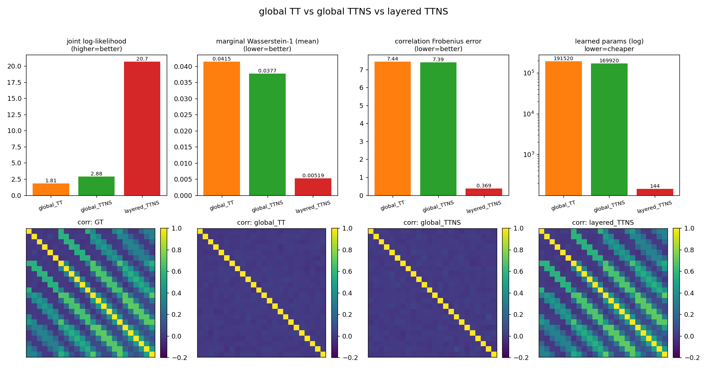
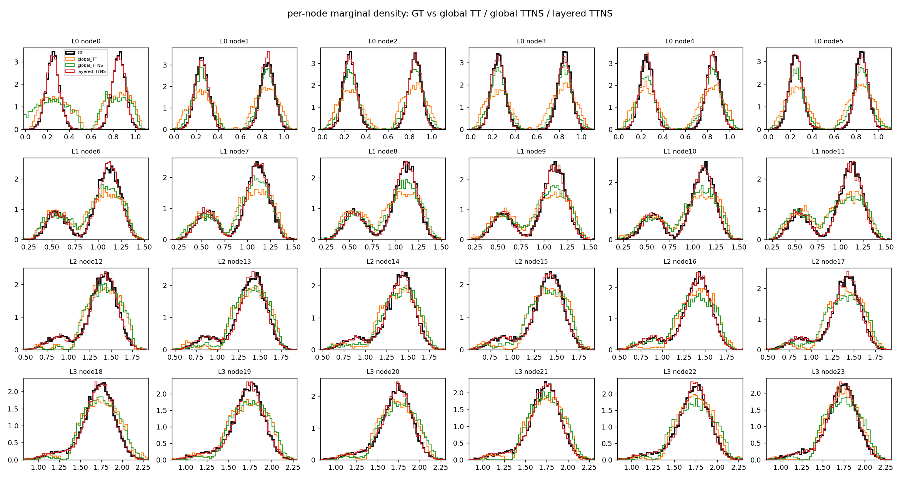

# 复杂分布：全局 TT vs 全局 TTNS vs 分层 TTNS（含图像）

在更难的设定上复测：**更深更大的 DAG（`layer_sizes=[6,6,6,6]`，24 节点，fanin=2，环形）+ 双峰源分布**。

- **双峰源**：每个源节点 $\sim 0.5\,\mathcal N(0.25,0.06)+0.5\,\mathcal N(0.85,0.06)$（明显多峰，比均匀复杂得多）。
- max-plus 延迟核仍为均匀 $e,d\sim U[0,0.25]$（保证分层模型闭式核成立、对比公平；源由森林从数据学习）。
- $n_{\text{total}}=50000$，基函数 $m=24$，扁平模型参数预算 $\approx 2\times10^5$。

## 指标

| 模型 | 学习参数量 | joint_LL ↑ | 边缘 W1 均值 ↓ | 相关 Frobenius 误差 ↓ |
|---|---|---|---|---|
| global_TT | 191520 | 1.808 | 0.0415 | 7.439 |
| global_TTNS | 169920 | 2.882 | 0.0377 | 7.394 |
| **layered_TTNS** | **144** | **20.689** | **0.0052** | **0.369** |

分层模型用 **144** 个学习参数，joint_LL 比最优扁平高 **~17.8 nats/样本**，相关误差小 **~20 倍**。

## 图像

总览（柱状指标 + 相关矩阵热图）：

逐节点边缘密度切片（黑=真值，橙=全局TT，绿=全局TTNS，红=分层TTNS）：

## 解读

- **边缘（切片图）**：源层 $L_0$ 是清晰的**双峰**；**分层 TTNS（红）几乎完美复刻真值的双峰/多峰形状**（各层都贴合），而全局 TT（橙）、全局 TTNS（绿）把两个峰**抹平/糊掉**，深层尤其明显。
- **相关结构（热图）**：真值是宽带状的环形相关；两个全局扁平模型**几乎只剩对角线**（corr_fro≈7.4，完全没抓住跨层 max-plus 依赖）；**分层 TTNS 的热图与真值几乎一致**（corr_fro 0.369）。
- 分布越复杂（多峰 + 更深的环形依赖），**结构感知的分层建模**相对**整体扁平建模**的优势越大，且参数量差出三个数量级。
