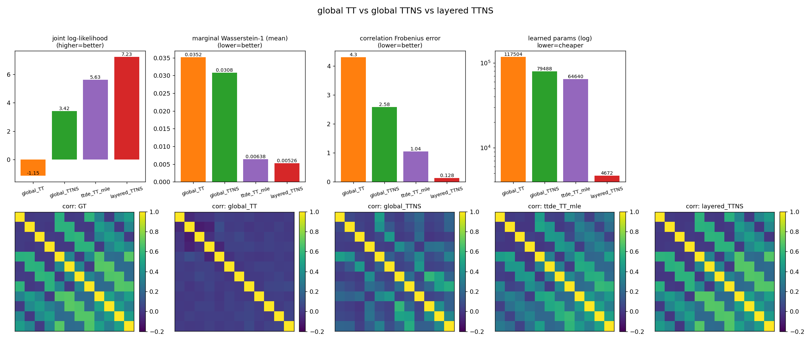
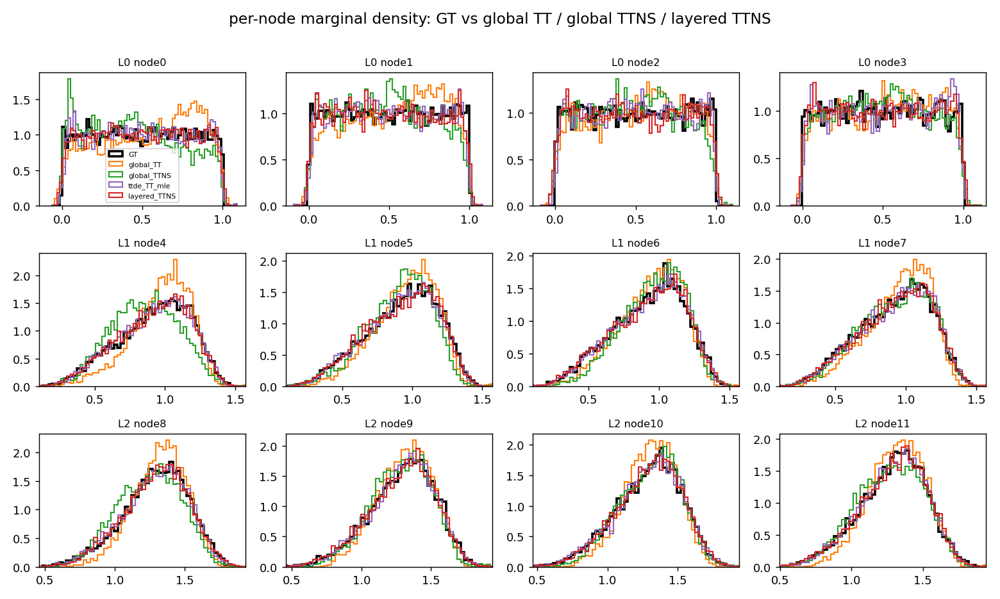

# 全局 TT vs 全局 TTNS vs 分层 TTNS（含图像）

三者拟合同一份多层 DAG 全联合数据（`layer_sizes=[4,4,4]`，12 节点，fanin=2，环形；
delay $e,d\sim U[0,0.25]$，$n_{\text{total}}=40000$）。

- **全局 TT**：把 12 节点当整体，链式拓扑（chain）拟合 L2 密度。
- **全局 TTNS**：把 12 节点当整体，chow-liu 树拓扑拟合 L2 密度。
- **TTDE TT（MLE）**：原版 TTDE 的平方参数化 TT（$p=\tilde q^2/Z$，链式），用**极大似然**训练；采样用平方 TT 的**条件 CDF 环境法**（左向量 + 右环境矩阵，见 `ttde_tt_baseline.py`）。这是与我们 L2 路线**不同的经典强基线**。
- **分层 TTNS**：**每一层都按相关性（MI）分块、每块拟合一个 Chow-Liu 树结构的 TTNS**（`fit_layer_forest` 作用在每层）；层间用已知延迟 $F_{ij}$ 的 max-plus 关系连接（`clarify.md` 的解析 CDF）。`learned_params` 记**全图各层 TTNS 参数之和**；joint_LL 由 $p(x)=p_{\text{forest}}(L_0)\prod_{l\ge1}\prod_{v}K_v(x_v\mid\mathrm{pa}(v))$ 给出（层间核已知）。

四个模型都用**同一套误差体系**评估：留出集平均联合对数密度 joint_LL、逐节点边缘 W1 均值、相关矩阵 Frobenius 误差。

> 参数量口径已更正：分层模型现按**全图每层 TTNS**统计（此前只算源层 $L_0$ 的 64，是错误口径）。层间延迟核仍为已知（结构+核为 oracle，非学习）。

## 指标

| 模型 | 学习参数量 | joint_LL（越高越好） | 边缘 W1 均值（越低越好） | 相关 Frobenius 误差（越低越好） |
|---|---|---|---|---|
| global_TT | 117504 | -1.154 | 0.0352 | 4.296 |
| global_TTNS | 79488 | 3.422 | 0.0308 | 2.580 |
| ttde_TT_mle | 64640 | 5.630 | 0.0064 | 1.043 |
| **layered_TTNS** | **4672** | **7.231** | **0.0053** | **0.128** |

- **TTDE（MLE 平方 TT）是明显更强的扁平基线**：joint_LL、W1、corr_fro 三项都大幅超过我们的全局 TT / 全局 TTNS（L2）。这说明"平方参数化 + 极大似然"比"L2 目标"更擅长拟合全联合。
- **分层 TTNS 仍全面领先**：即便按全图口径（4672 参数，约 TTDE 的 1/14），三项指标仍优于 TTDE，尤其相关结构（0.128 vs 1.043）优势最大。

## 图像

总览（柱状指标 + 各模型相关矩阵热图，紫=TTDE）：

逐节点边缘密度切片（黑=真值，橙=全局TT，绿=全局TTNS，紫=TTDE，红=分层TTNS）：

## 解读

- **相关结构（热图）**：真值是带环的块状相关；**全局 TT 几乎只剩对角线**（corr_fro 4.30）；全局 TTNS 偏弱（2.58）；**TTDE 的热图已明显恢复块状结构**（1.04），远好于两条 L2 扁平线；**分层 TTNS 的热图与真值几乎一致**（0.128）。
- **边缘（切片图）**：全局 TT（橙）在深层明显偏移、过尖；全局 TTNS（绿）有抖动；**TTDE（紫）边缘已很贴合**；**分层 TTNS（红）最紧贴真值**。
- **本质原因**：分层模型把"已知的 DAG 结构 + max-plus 延迟核"作为先验，只需逐层学各层的 TTNS 密度（层间条件由已知核给出）；扁平模型（含 TTDE）只能从样本硬学全 12 维联合，即便 MLE 很强，也更费参数、且难以完全抓住 max 诱导的跨层依赖。

结论：在结构与延迟核已知的多层 DAG 上，**TTDE（MLE 平方 TT）是比我们 L2 全局模型强得多的扁平基线**，但**结构感知的分层 TTNS（每层皆 TTNS）以更少参数仍显著领先**。
