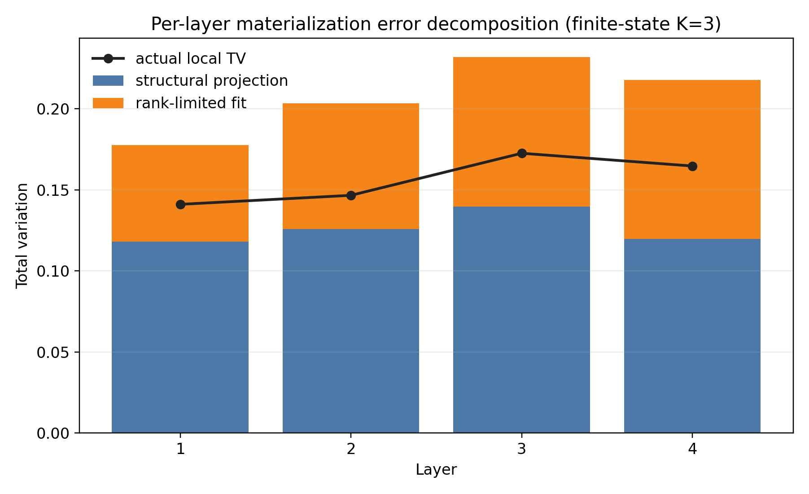
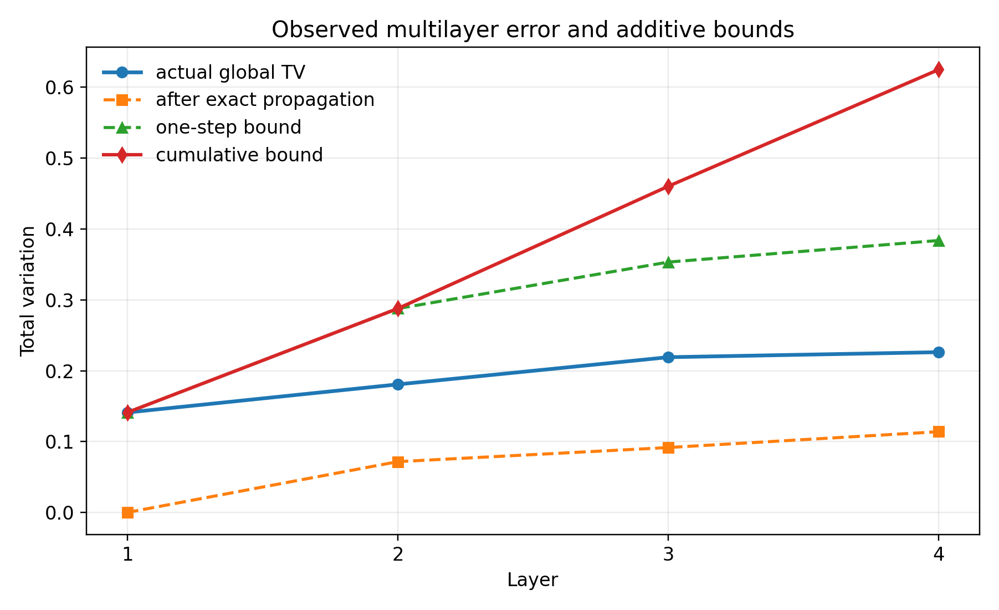
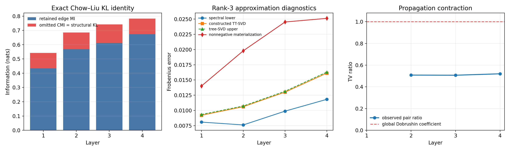

# 多层 TTNS max-plus 误差分析

## 1. 目的与证据范围

本报告验证“单层新增误差如何进入多层累积界”。报告只使用确定性小维模型，
不使用 Monte Carlo，不训练 Dense/UCI 大模型。最终机器可读结果为
`multilayer_error_analysis_metrics.json`，复现入口为
`experiments/audit_multilayer_error_propagation.py`。

本次审计包含两个互补部分。

1. 连续单层审计使用 $K=3$ 的 rank-2 mixture-of-products 上游密度和父节点集合
   $(0,1)$、$(1,2)$、$(2,0)$。它在同一个输出网格上比较高分辨率 joint
   contraction、默认分辨率 joint contraction、Chow--Liu tree projection 和
   rank-limited 非负 tree materialization。
2. 有限状态多层审计使用 $K=3$、$L=4$ 的完整概率质量表。每层 max-plus
   传播均由确定性张量收缩完成，因此该部分报告的 TV 是有限状态概率测度之间的
   精确 total variation，误差只来自浮点运算。

定理允许任意有限 $K$。这里选择 $K=3$，只是为了保存和比较完整联合概率表；
不能把这一实验限制写成定理限制。

## 2. 多层误差定理

设真实分布满足

$$
P_\ell=P_{\ell-1}K_\ell,
$$

其中 $K_\ell$ 是第 $\ell$ 层的 max-plus Markov kernel。设上一层 TTNS
近似为 $Q_{\ell-1}$，从它出发的精确传播分布为

$$
\widetilde Q_\ell=Q_{\ell-1}K_\ell.
$$

第 $\ell$ 层新增的材料化误差定义为

$$
\eta_\ell
=
\|\widetilde Q_\ell-Q_\ell\|_{\mathrm{TV}}.
$$

Markov kernel 的 total variation contraction 和三角不等式给出

$$
\|P_\ell-Q_\ell\|_{\mathrm{TV}}
\le
\|P_{\ell-1}-Q_{\ell-1}\|_{\mathrm{TV}}
+
\eta_\ell.
$$

递推以后，

$$
\boxed{
\|P_L-Q_L\|_{\mathrm{TV}}
\le
\|P_0-Q_0\|_{\mathrm{TV}}
+
\sum_{\ell=1}^{L}\eta_\ell.
}
$$

上式只是稳定性骨架，不应作为论文最终的“定量定理”。

### 2.1 完整概率表上的事后 certificate

有限状态精确传播时，
令

$$
R_\ell=Q_{\ell-1}K_\ell
$$

并令 $R_\ell^{T_\ell}$ 是 $R_\ell$ 在选定 forest $T_\ell$ 上、保留真实根边缘
和 tree-edge conditionals 的 Chow--Liu projection。定义
$\mathcal A_{\ell,j}$ 为相容次序中位于 $v_j$ 之前、但不包括其 tree parent
的节点集合，并令

$$
\begin{aligned}
S_\ell
&=
\operatorname{TC}_{R_\ell}(Y)
-
\sum_{(u,v)\in E(T_\ell)}
I_{R_\ell}(Y_u;Y_v)\\
&=
\sum_j
I_{R_\ell}
\left(
Y_{v_j};
Y_{\mathcal A_{\ell,j}}
\mid
Y_{\operatorname{pa}_{T_\ell}(v_j)}
\right).
\end{aligned}
$$

因此 $S_\ell$ 就是 tree projection 删除的条件互信息总量，而不是未解释的
“结构误差”。再令

$$
\begin{aligned}
D_\ell
={}&
\sum_r
D_{\mathrm{KL}}
\left(
(R_\ell^{T_\ell})_r
\middle\|
(Q_\ell)_r
\right)\\
&+
\sum_{v\notin\operatorname{root}(T_\ell)}
\mathbb E_{X\sim
(R_\ell^{T_\ell})_{\operatorname{pa}_{T_\ell}(v)}}
D_{\mathrm{KL}}
\left(
(R_\ell^{T_\ell})_v(\cdot\mid X)
\middle\|
(Q_\ell)_v(\cdot\mid X)
\right).
\end{aligned}
$$

$D_\ell$ 精确等于
$D_{\mathrm{KL}}(R_\ell^{T_\ell}\|Q_\ell)$，也等于 conditional
cross-entropy 相对于无限容量 tree optimum 的 excess。令 $A_\ell$ 为相同
逐根、逐边 conditional TV 的父边缘加权和，令 $n_\ell$ 是 joint table 的
cell 数。则

$$
b_\ell
=
\min
\left\{
A_\ell,\,
\sqrt{\frac{D_\ell}{2}},\,
\frac{\sqrt{n_\ell}}{2}
\|R_\ell^{T_\ell}-Q_\ell\|_F
\right\}
$$

是拟合 TV 的三个可计算上界中最小者。由完整概率表事后计算得到的 certificate
为

$$
\boxed{
\|P_L-Q_L\|_{\mathrm{TV}}
\le
\|P_0-Q_0\|_{\mathrm{TV}}
+
\sum_{\ell=1}^{L}
\left[
\sqrt{\frac{S_\ell}{2}}
+
b_\ell
\right].
}
$$

这个式子仍依赖从完整 joint table 回算的 $S_\ell,D_\ell,A_\ell$，所以不是
先验理论误差率。后文出现的 0.302104、0.641562、1.020336 和 1.385602
只是在固定人工模型上对这个事后式子的审计；后两项超过 TV 的自然上限，已经
是无信息的界，不能作为论文主结果。

### 2.2 参数级先验定理

真正的定理 2 改用传播前声明的模型常数。若第 $\ell$ 层满足：

- edge-delay 截断事件的尾概率为 $\tau_\ell^{\mathrm{edge}}$；
- 截断事件上无噪声 max-plus 输出属于紧集 $\mathcal U_\ell$；
- node-delay density 为 $g_\ell$；
- 数值积分尾概率、步长和二阶导数常数给出 $\nu_\ell$；
- 被 tree 删除的 log-interaction oscillation 不超过 $\Omega_\ell$；
- tree conditional 的 TV-Hölder 参数为
  $(L_{\ell,v},s_{\ell,v})$，parent 区间长度为 $D_{\ell,v}$，bond rank 为
  $r_{\ell,v}$；

则定义

$$
\begin{aligned}
\beta_\ell
&=
(1-\tau_\ell^{\mathrm{edge}})
\int
\inf_{u\in\mathcal U_\ell}
g_\ell(y-u)\,dy,\\
\rho_\ell
&=
1-\beta_\ell,\\
\mathfrak s(\Omega_\ell)
&=
\min
\left\{
1,\,
\sqrt{\frac{\Omega_\ell}{2}},\,
\frac{e^{\Omega_\ell}-1}{\sqrt2}
\right\},\\
a_\ell
&=
\sum_{v\notin\operatorname{root}(T_\ell)}
L_{\ell,v}
\left(
\frac{D_{\ell,v}}{r_{\ell,v}}
\right)^{s_{\ell,v}}.
\end{aligned}
$$

定理给出

$$
\boxed{
\begin{aligned}
\|P_L-Q_L\|_{\mathrm{TV}}
\le{}&
\|P_0-Q_0\|_{\mathrm{TV}}
\prod_{\ell=1}^{L}\rho_\ell\\
&+
\sum_{\ell=1}^{L}
\left[
\nu_\ell+\mathfrak s(\Omega_\ell)+a_\ell
\right]
\prod_{j=\ell+1}^{L}\rho_j.
\end{aligned}
}
$$

其中 $\nu_\ell$ 在 tensor-product trapezoidal rule 的 $C^2$ 条件下具有
显式公式

$$
\nu_\ell
=
\tau_\ell^{\mathrm{quad}}
+
\frac{
n_\ell\operatorname{vol}(\mathcal B_\ell)
}{
12(1-\tau_\ell^{\mathrm{quad}})
}
\sum_q h_{\ell,q}^2B_{\ell,q}.
$$

$\mathfrak s(\Omega_\ell)$ 来自 tree information projection、likelihood-ratio
oscillation 和 Pinsker；$a_\ell$ 来自一个明确的非负 parent-bin
rank-$r$ construction；$\rho_\ell$ 来自 Doeblin common-overlap
minorization。它们都不是从最终误差表中回算的量。

本报告的有限状态审计满足 $P_0=Q_0$，而且每层传播是有限求和，所以初始项和
数值积分项都严格为零。连续审计中的 `q_grid` 差异只称为 grid-estimated
numerical error；Uniform delay CDF 有 kink，未验证 $C^2$ 条件，因此不把它
包装成未经证明的 $O(h^2)$ 项。

抽象递推、Wasserstein 版本、事后 certificate 和先验结论分别见
`maxplus_ttns_cdf_theorem_zh.md` 的命题 2、命题 2B、命题 2F 和定理 2。
结构 KL 恒等式、rank 谱界和三个拟合界见命题 2C--2E。这些工具以经典信息论、
矩阵逼近和 Markov contraction 为基础；参数级组合及其对 TTNS max-plus
逐层材料化的对应才是需要进一步检索新颖性的部分。

## 3. 连续单层误差分解

### 3.1 配置

上游密度是两个三维 product Beta density 的混合，混合权重为 $0.45$ 和
$0.55$。三个输出的父节点集合为

$$
P_1=(0,1),\qquad
P_2=(1,2),\qquad
P_3=(2,0).
$$

edge delay 为 $\mathrm{Uniform}(0,0.3)$，node delay 为零。输出网格包含
31 个点，范围为 $[-0.1,1.4]$。默认局部积分使用 `q_grid=401`，高分辨率
参考使用 `q_grid=4001`。Chow--Liu 条件矩阵使用非负 rank-3 分解材料化，
固定 `seed=20260727` 和 600 次确定性更新。为避免浮点下溢造成正向 KL
的支撑不匹配，近似 conditional entries 使用
`conditional_probability_floor=1e-12` 后逐列重新归一化。全部配置来自
`multilayer_error_analysis_metrics.json` 的
`continuous_single_layer.configuration`。

这里的 rank-limited 分布确实属于离散非负 TTNS 类。若树边条件矩阵写成

$$
p(x_v\mid x_{\operatorname{pa}(v)})
\approx
\sum_{\alpha=1}^{r}
U_v(x_v,\alpha)
V_v(\alpha,x_{\operatorname{pa}(v)}),
$$

则可以把每条边的 $U_v,V_v$ 分别吸收到子节点和父节点 core；在分叉节点处把
各子边的 $V_v$ 相乘并吸收到同一个父 core。所得 tree tensor network 的每条
bond rank 不超过 $r=3$。本次使用确定性非负矩阵分解构造这些因子，没有调用
仓库当前的 spline R5 优化器。

所有连续误差都在同一个输出 CDF 网格上转换成归一化 cell-mass table 后计算。
因此它们是 grid-estimated/discretized TV，不是连续密度的严格 TV 上界。

### 3.2 结果

来源：
`multilayer_error_analysis_metrics.json` 的
`continuous_single_layer.errors`。

| 项目 | grid-estimated TV |
|---|---:|
| $\eta^{\mathrm{num}}$ | 0.0000421143 |
| $\eta^{\mathrm{struct}}$ | 0.136265809 |
| $\eta^{\mathrm{fit}}$ | 0.040144033 |
| 实际总误差 | 0.142685851 |
| 三项相加上界 | 0.176451956 |
| 上界松弛量 | 0.033766105 |

三角不等式

$$
0.142685851
\le
0.0000421143+0.136265809+0.040144033
=0.176451956
$$

成立。在这一人工配置中，结构投影误差约为数值误差的 $3.24\times10^3$ 倍，
说明默认与高分辨率局部积分的差异不是主要误差源。这个数量关系只对当前固定配置
成立，不能写成一般结论。

高分辨率 joint CDF 的范围为 $[0,1]$，逐坐标单调性违反为 0。joint 与单独
计算的 marginal、pair CDF 最大差分别为 $1.11\times10^{-16}$ 和
$2.22\times10^{-16}$，输出排列误差为 0。来源是同一 JSON 的
`continuous_single_layer.diagnostics`。

### 3.3 结构、选树与 rank 的定量结果

来源为 JSON 的 `continuous_single_layer.quantitative_structure`、
`quantitative_rank` 和 `quantitative_nonnegative_fit`。

该构造的 total correlation 为 0.297451 nat，选中两条 tree edges 保留的
mutual information 之和为 0.197574 nat。两者之差满足

$$
\begin{aligned}
D_{\mathrm{KL}}(P\|Q_T)
&=
\operatorname{TC}(P)-\sum_{e\in T}I_e\\
&=
0.297451-0.197574\\
&=
0.0998766\ {\rm nat}.
\end{aligned}
$$

脚本以 0-based 坐标记录选中树 `parent=[-1,2,0]`；换成本文的 1-based
数学下标，同一数值还精确等于

$$
I(Y_2;Y_1\mid Y_3)=0.0998766\ {\rm nat}.
$$

KL 与 `TC-edge MI` 恒等式的绝对误差为 $4.16\times10^{-16}$，KL 与条件互信息
分解的绝对误差为 $1.50\times10^{-15}$。Pinsker 给出的结构 TV 上界为
0.223469，实际结构 TV 为 0.136266。该界有效但仍有约 64% 的相对松弛。

默认和参考分辨率之间的最大 edge MI 误差为
$8.37\times10^{-6}$ nat。默认分辨率选择的树与参考最优树相同，真实 MI
regret 为 0；一般的 $2(K-1)\epsilon$ 上界为 $3.35\times10^{-5}$ nat。
这说明当前 `q_grid` 误差没有改变该构造中的选树结果。

对 tree target 的每条 cut 计算奇异值后，rank-3 TTNS 的全局 Frobenius
误差下界为

$$
8.82\times10^{-4}.
$$

标准无符号 TT-SVD 的构造误差为 $1.1630\times10^{-3}$，奇异值尾部给出的
tree-SVD 上界为 $1.1682\times10^{-3}$。实际非负材料化误差为
$1.5596\times10^{-3}$。因此，该固定构造中从无符号 TT-SVD 到非负材料化的
额外差距约为 $3.97\times10^{-4}$，但这一差距同时包含非负约束和当前 NMF
算法误差，不能将其全部归因于非负性。

两条 conditional kernels 的父边缘加权 TV 分别为 0.028176 和 0.023634，
相加得到严格上界 0.051810；实际 fitting TV 为 0.040144。这个界比逐列
supremum 相加得到的 0.419817 明显更紧。

同一 fitting error 也可用 conditional KL 解释。两条边的父边缘加权
conditional KL 分别为 0.0143252 nat 和 0.00658589 nat，其和

$$
D_{\mathrm{fit}}=0.0209111\ {\rm nat}
$$

与 joint $D_{\mathrm{KL}}(Q_T\|\widehat Q_T)$ 的差为
$3.09\times10^{-16}$。Pinsker 给出 fitting TV 上界 0.102252；
由 $n=31^3=29791$ 个 cells 和 joint Frobenius error 得到的
$\sqrt n\|\cdot\|_F/2$ 上界为 0.134593。因此三个可计算 fitting bounds
中，本例采用最小的 conditional-TV 上界 0.051810。加入结构 Pinsker 界和
grid-estimated numerical TV 后，完全显式的单层上界为

$$
0.0000421+0.223469+0.051810=0.275321.
$$

这一界覆盖实际总 grid TV 0.142686，但比直接三项 TV 相加的 0.176452 更松。

## 4. 四层有限状态误差累积

### 4.1 配置与误差含义

有限状态空间为 $\{0,\ldots,16\}^3$。初始分布是两个 product discrete
Gaussian profile 的混合。每个输出仍使用循环共享父结构
$(0,1)$、$(1,2)$、$(2,0)$。edge delay 的概率质量为

$$
\mathbb P(E=0)=0.65,\qquad
\mathbb P(E=1)=0.35.
$$

状态 16 是饱和上边界，node delay 为零。每层先精确传播完整概率表，再做
Chow--Liu tree projection，最后以非负 rank-3 条件矩阵分解得到材料化分布。
近似 conditional entries 同样使用 $10^{-12}$ probability floor 并逐列归一化。
这里报告的 TV 是归一化有限状态概率表之间的精确 TV。

### 4.2 逐层结果

来源：
`multilayer_error_analysis_metrics.json` 的
`finite_state_multilayer.layers`。

| 层 | 继承 TV | 精确传播后 TV | 结构 TV | 拟合 TV | 单层实际新增 TV | 实际全局 TV | 累积上界 |
|---:|---:|---:|---:|---:|---:|---:|---:|
| 1 | 0.000000 | 0.000000 | 0.118170 | 0.059351 | 0.141049 | 0.141049 | 0.141049 |
| 2 | 0.141049 | 0.071698 | 0.125794 | 0.077487 | 0.146610 | 0.180693 | 0.287659 |
| 3 | 0.180693 | 0.091627 | 0.139683 | 0.092168 | 0.172562 | 0.219070 | 0.460221 |
| 4 | 0.219070 | 0.113971 | 0.119704 | 0.098194 | 0.164692 | 0.226152 | 0.624913 |

每一层均满足

$$
\|P_{\ell-1}K_\ell-Q_{\ell-1}K_\ell\|_{\mathrm{TV}}
\le
\|P_{\ell-1}-Q_{\ell-1}\|_{\mathrm{TV}},
$$

并且

$$
\|P_\ell-Q_\ell\|_{\mathrm{TV}}
\le
\|P_{\ell-1}-Q_{\ell-1}\|_{\mathrm{TV}}
+
\eta_\ell.
$$

JSON 中所有相关 inequality violation 均为 0。到第 4 层，实际全局 TV 为
0.226152，而保守累积上界为 0.624913。该上界正确但较松；这符合逐层使用三角
不等式时通常出现的现象。

值得注意的是，精确传播后的 inherited error 从第 2 层到第 4 层分别为
0.071698、0.091627 和 0.113971，均低于传播前的 0.141049、0.180693 和
0.219070。这一结果与 Markov contraction 一致，但不能由单个构造进一步宣称
所有实际网络都会严格缩小误差。

### 4.3 每层遗漏条件互信息

每层结构 KL 都同时通过三种独立表达计算：

$$
D_{\mathrm{KL}}(P\|Q_T),
\qquad
\operatorname{TC}(P)-\sum_{e\in T}I_e,
\qquad
\sum_v I(Y_v;Y_{\mathrm{omitted}(v)}\mid Y_{\operatorname{pa}_T(v)}).
$$

三种结果在所有四层均对齐，最大恒等式误差低于 $2\times10^{-15}$。

| 层 | total correlation | 保留 edge MI | 遗漏 CMI / 结构 KL | 实际结构 TV | Pinsker 上界 |
|---:|---:|---:|---:|---:|---:|
| 1 | 0.541916 | 0.434427 | 0.107488 | 0.118170 | 0.231828 |
| 2 | 0.684952 | 0.568639 | 0.116313 | 0.125794 | 0.241157 |
| 3 | 0.741624 | 0.611558 | 0.130066 | 0.139683 | 0.255016 |
| 4 | 0.782390 | 0.672955 | 0.109434 | 0.119704 | 0.233917 |

这张表给出了比抽象 $\eta_\ell^{\mathrm{struct}}$ 更明确的解释。例如第 3 层
total correlation 为 0.741624 nat，选中 tree edges 保留了 0.611558 nat，
剩余 0.130066 nat 正好是 tree conditional independence 删除的条件互信息。

### 4.4 Rank 极限、非负材料化与传播系数

| 层 | 谱下界 | 无符号 TT-SVD | tree-SVD 上界 | 非负材料化 Frobenius | 实际 fitting TV | conditional-TV 上界 |
|---:|---:|---:|---:|---:|---:|---:|
| 1 | 0.008083 | 0.009202 | 0.009328 | 0.014013 | 0.059351 | 0.070276 |
| 2 | 0.007616 | 0.010610 | 0.010722 | 0.019791 | 0.077487 | 0.098302 |
| 3 | 0.009883 | 0.013002 | 0.013142 | 0.024524 | 0.092168 | 0.123758 |
| 4 | 0.011821 | 0.016123 | 0.016290 | 0.025119 | 0.098194 | 0.131349 |

每层实际非负 TTNS Frobenius error 均高于 rank 谱下界；构造的无符号 TT-SVD
均低于对应 tree-SVD 奇异值尾部上界。conditional-TV 上界也在每层覆盖实际
fitting TV。它们分别检查了“任何 rank-3 TTNS 都无法低于的误差”“无符号
rank-3 构造可以达到的误差”和“当前非负材料化实际达到的误差”。

拟合项还通过 KL chain rule 完全展开如下。`conditional KL` 是各 tree edge
在真实父边缘下的加权 conditional KL 之和；它与 joint fit KL 的最大差低于
$7\times10^{-16}$。`KL-Pinsker` 和 `Frobenius-TV` 分别是
$\sqrt{D_\ell/2}$ 与
$\sqrt{4913}\|R_\ell^{T_\ell}-Q_\ell\|_F/2$。

| 层 | conditional KL / excess CE | KL-Pinsker | conditional-TV | Frobenius-TV | 采用的最小界 |
|---:|---:|---:|---:|---:|---:|
| 1 | 0.045882 | 0.151463 | 0.070276 | 0.491115 | 0.070276 |
| 2 | 0.043528 | 0.147526 | 0.098302 | 0.693590 | 0.098302 |
| 3 | 0.067627 | 0.183884 | 0.123758 | 0.859479 | 0.123758 |
| 4 | 0.073643 | 0.191889 | 0.131349 | 0.880316 | 0.131349 |

因此拟合项已经不再是未解释的 $B_\ell$：它既可以由逐列 conditional TV
直接求和，也可以由 conditional cross-entropy excess 或 joint Frobenius
residual 估界。本构造中第一种界最紧。

有限状态 kernel 的全局 Dobrushin coefficient 等于 1。证据是输入状态
$(0,0,0)$ 和 $(16,16,16)$ 的条件输出支撑不相交。因此不能对所有输入分布证明
严格收缩。对于本次实际传播的分布对，第 2--4 层事后 TV 比值分别为

$$
0.5083,\qquad0.5071,\qquad0.5203.
$$

这些比值定量说明当前分布对在传播后约保留一半 TV 误差，但它们是
distribution-pair-specific 的事后量，不是全局 kernel 常数。

命题 2F 的事后 certificate 逐层代入如下。由于传播由有限和精确计算，数值项为 0；
由于 $P_0=Q_0$，初始项也为 0。

| 层 | $\sqrt{S_\ell/2}$ | $b_\ell$ | 本层事后上界 | 累计事后上界 | 实际全局 TV |
|---:|---:|---:|---:|---:|---:|
| 1 | 0.231828 | 0.070276 | 0.302104 | 0.302104 | 0.141049 |
| 2 | 0.241157 | 0.098302 | 0.339458 | 0.641562 | 0.180693 |
| 3 | 0.255016 | 0.123758 | 0.378774 | 1.020336 | 0.219070 |
| 4 | 0.233917 | 0.131349 | 0.365266 | 1.385602 | 0.226152 |

这些数值只用于说明朴素信息论 certificate 的松弛，不能作为先验理论结果。
它们虽覆盖实际全局 TV，但比直接使用已知局部 TV 的累积界更松，且从第 3 层
开始超过 TV 的自然上限 1。界松的主要来源可逐项定位：结构项使用
Pinsker 后约为实际结构 TV 的 1.8--2.0 倍；拟合项的 conditional-TV 上界约为
实际 fitting TV 的 1.18--1.34 倍；跨层则再次使用三角不等式。投稿时应同时
把它标记为 negative/boundary diagnostic，而不能把它包装成有效的多层理论优势。







## 5. 验证状态

最终 JSON 状态为 `pass`，共 116 项检查全部通过。检查覆盖：

- 单层三项误差的三角不等式；
- 多层 Markov contraction、单步递推和累积界；
- CDF 范围和逐坐标单调性；
- 概率质量非负与归一化；
- joint/marginal/pair 一致性；
- 输出排列不变性；
- Chow--Liu KL、total correlation 和条件互信息恒等式；
- MI 估计误差导致的选树 regret 上界；
- tree-cut 谱下界、构造 TT-SVD 上界、非负条件核 TV 界、conditional KL
  chain rule、KL-Pinsker 界和 Frobenius-TV 界；
- 分布对传播收缩比和显式定量多层界。

本报告不使用这些数值实验证明数学定理。定理由概率测度上的 contraction、
信息论恒等式、Eckart--Young theorem、正交 tree-SVD 和 hybrid-kernel
telescoping 证明；实验只验证审计实现与公式一致，并说明在两个固定人工配置中
各误差项的相对规模。

## 6. 可以与不能支持的论文论断

当前结果可以支持以下有限论断。

1. 逐层 TTNS 材料化误差可以分解为数值、结构和拟合三项，并通过三角不等式接入
   多层 total variation 累积界。
2. 在确定性 $K=3,L=4$ 有限状态构造中，max-plus 传播没有违反 TV contraction，
   四层实际误差始终位于单步和累积上界以内。
3. 在本次连续单层构造中，结构投影误差明显大于默认与高分辨率局部积分之间的
   grid-estimated error。
4. 对精确 Chow--Liu projection，结构 KL 等于 total correlation 减去选中
   tree-edge MI，并等于被 tree 删除的条件互信息之和。
5. 对固定 rank，可以用 tree-cut 奇异值尾部给出任意 TTNS 的误差下界，并用
   无符号 TT-SVD 提供构造上界；非负 conditional factorization 另有直接 TV 界。

当前结果不能支持以下论断。

1. 不能声称真实 Dense/UCI 多层任务的结构误差也一定占主导。
2. 不能把连续单层的 grid-estimated TV 写成连续分布的严格 TV。
3. 不能声称累积上界紧，当前第 4 层上界明显高于实际误差。
4. 不能声称结果具有统计显著性；本实验是固定配置的确定性验证，不是多 seed
   性能实验。
5. 不能声称 rank-3 离散条件矩阵材料化等同于当前 spline R5 优化器；它验证的是
   同一“结构投影后再做有限 rank 材料化”的数学误差链。

## 7. 复现

在仓库根目录运行：

```bash
MPLCONFIGDIR=/tmp/ttns_mplconfig \
python3 simple_ttns_l2/experiments/audit_multilayer_error_propagation.py
```

脚本会覆盖生成以下派生产物：

- `simple_ttns_l2/reports/multilayer_error_analysis_metrics.json`；
- `simple_ttns_l2/reports/multilayer_error_decomposition.png`；
- `simple_ttns_l2/reports/multilayer_error_bound.png`；
- `simple_ttns_l2/reports/multilayer_quantitative_diagnostics.png`。

运行时间字段只用于确认该审计属于轻量任务，不用于论文方法间性能比较。
