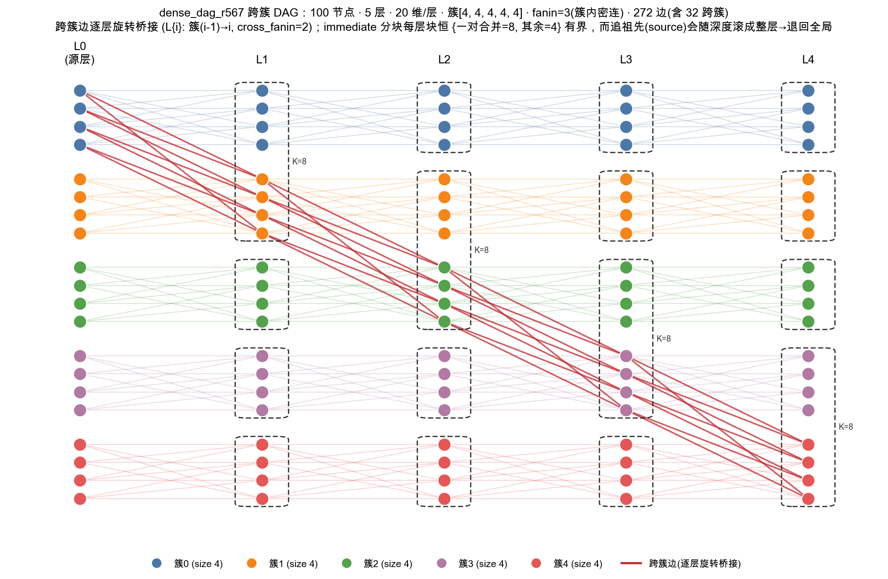
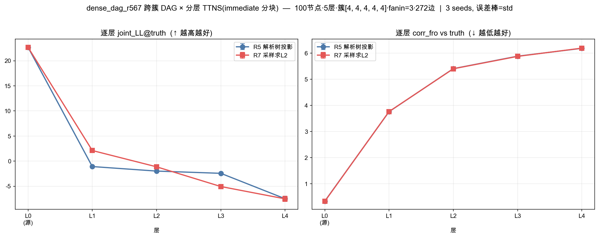
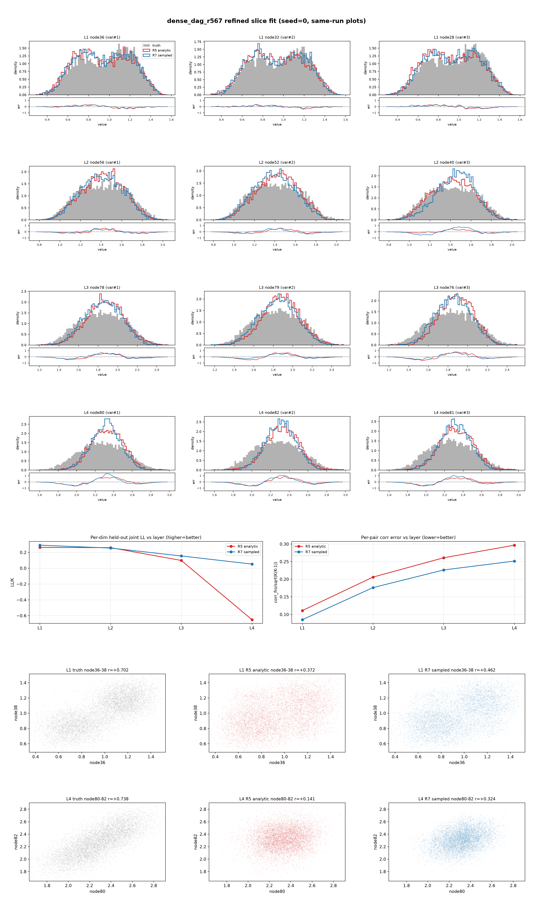
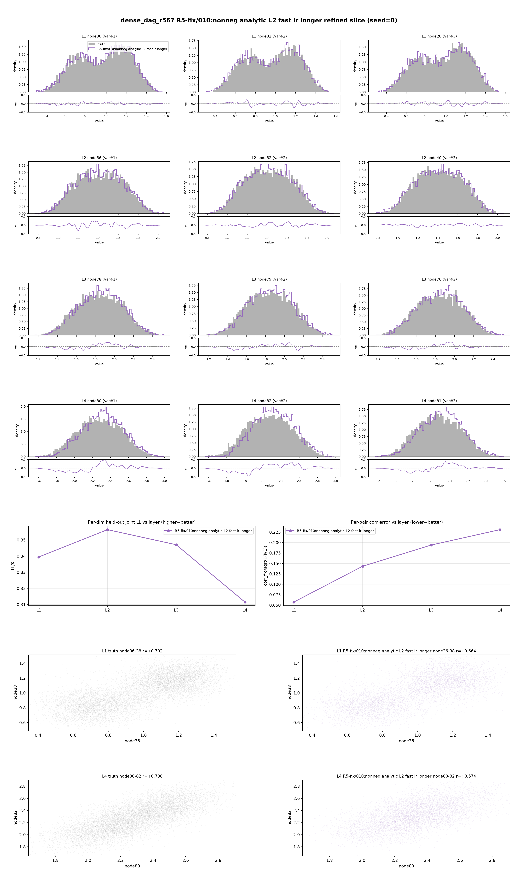
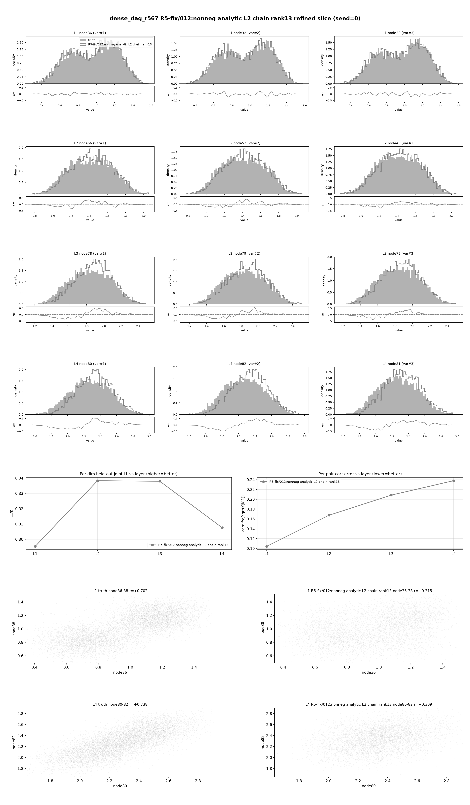

# TTNS 多层 DAG 密度估计项目报告

## 摘要

本项目的目标是把张量列车（Tensor Train, TT）密度估计推广到树结构张量网络（Tree Tensor Network State, TTNS），再进一步用于多层有向无环图（Directed Acyclic Graph, DAG）上的密度传播。简单说，我们希望用一棵树或一组树来表示高维联合密度，并让这种表示能够沿着多层图的父子关系向下传播。

目前项目已经完成三件关键事情：

1. 在单层合成目标上验证 TTNS 比链式 TT 更适合表达树状或 DAG 状依赖。
2. 用 Chow-Liu 方法从数据中自动学习层内树结构，避免手工指定拓扑。
3. 在一个较复杂的多层密连接 DAG 上实现并修复了全解析传播方法。最终结果说明：不需要逐层采样，直接用解析积分传播，再配合非负 L2 拟合，就可以稳定拟合后层分布。

最终修复结果为：第 4 层平均对数似然达到 6.23，负密度比例为 0，模型标准差与真实标准差之比为 0.952，最强相关对的样本相关系数为 +0.534，真实值为 +0.758。这里平均对数似然越高越好，负密度比例越低越好，标准差比例越接近 1 越好。这些结果说明，多层解析 TTNS 路线是可行的。

*图 1：多层密连接 DAG 的结构示意图。实验对象有 5 层，每层 20 个节点。模型在每一层用若干个树结构张量网络表示联合密度，层与层之间通过延迟传播关系连接。*

## 1. Algorithm

### 1.1 用 TTNS 表示密度

TTNS 用树结构连接多个一维基函数。给定样本 $x=(x_1,\dots,x_d)$，模型密度写成

$$
q_\theta(x)=\langle T_\theta,\bigotimes_{k=1}^d b_k(x_k)\rangle .
$$

这里 $b_k(x_k)$ 是第 $k$ 个变量上的样条基，$T_\theta$ 是树结构张量网络。相比普通 TT 链，TTNS 可以让变量按照树连接；如果目标分布的依赖也接近树结构，TTNS 通常比链更省参数、更准确。

训练主要有两条路线：

- L2 路线：最小化 $\int q_\theta^2 - 2\mathbb{E}_{p}[q_\theta]$。
- MLE 路线：最大化样本似然，并用平方或非负参数化保证密度非负。

本项目中多层 DAG 的最终修复使用的是非负解析 L2。具体做法是：不直接训练张量块 $C_i$，而是训练同形状的自由参数张量 $R_i$，并令 $C_i$ 的每个元素等于 $R_i$ 对应元素的平方：

$$
(C_i)_{a,b,c,\dots}=(R_i)_{a,b,c,\dots}^2.
$$

这里的平方是逐元素平方，不是矩阵平方或张量乘法平方。这样 $C_i$ 的所有元素都非负，从而避免模型产生负密度。

### 1.2 层内树结构

单层高维密度的关键问题是：树怎么选？

项目比较了三种结构：

- 固定链结构：也就是传统 TT。
- 固定平衡树。
- Chow-Liu 树：从训练样本估计两两互信息，再取最大生成树。

实验表明，Chow-Liu 是目前最稳的选择。它能从数据中自动找到主要依赖边，不需要人工猜拓扑。

### 1.3 多层 DAG 传播

多层 DAG 中，节点按层排列。上一层变量 $x_u$ 通过 max-plus 机制生成下一层变量 $y_v$：

$$
y_v=\max_{u\in \mathrm{pa}(v)}(x_u+e_{uv})+d_v .
$$

其中 $e_{uv}$ 是 edge delay，$d_v$ 是 node delay。项目采用的解析传播思路是：不从上一层模型采样，而是在 CDF 域计算下一层分布。

对一个下层节点 $v$，其 CDF 可写成

$$
F_v(s)=\mathbb{E}\left[\prod_{u\in \mathrm{pa}(v)}F_e(s-x_u)\right],
$$

再卷积节点自身的延迟。由于括号内是对每个父变量的可分离函数，这个期望可以通过上一层 TTNS 的张量收缩解析计算。两个下层节点的两维联合 CDF 也可以用同样方式计算。

这一步的作用是：把上一层已经拟合好的 TTNS 当成上层分布，用解析 CDF 传播到下一层，而不是先采样再传播。

### 1.4 每层如何拟合

每一层不是用一棵大树表示全部 20 个节点，而是按 DAG 结构拆成若干块。每个块内构造一个树目标：

1. 对块内每个节点计算解析 marginal。
2. 对块内每对节点计算解析 pair CDF。
3. 用 pair 信息选一棵块内树。
4. 构造树目标

$$
p_{\mathrm{tree}}(y)=p_r(y_r)\prod_{v\ne r}p(y_v\mid y_{\mathrm{pa}(v)}).
$$

然后用 TTNS 拟合这个树目标。最终推荐做法是：

- 使用非负张量块：$C_i=R_i^2$。
- 使用解析 L2 目标。
- 使用合适的优化步长。
- 训练 3000 步。

初始化时先用每个变量的一维边缘做独立初始化。因此初始模型的边缘大致正确，但变量之间的相关性基本为零；训练的主要任务就是把块内相关结构学出来。

### 1.5 树边上的收缩公式

这一节解释一个关键点：解析 L2 拟合为什么不用采样。我们要最小化

$$
L(\theta)=\int q_\theta(y)^2\,dy-2\mathbb{E}_{p_{\mathrm{tree}}}[q_\theta(y)].
$$

右边有两项。第一项是模型自己和自己的内积 $\int q_\theta^2$；第二项是目标分布和模型的交叉项 $\mathbb{E}_{p_{\mathrm{tree}}}[q_\theta]$。两项都能在树上从叶子往根收缩。

先看交叉项。块内树目标是

$$
p_{\mathrm{tree}}(y)
=
p_r(y_r)\prod_{v\ne r}p(y_v\mid y_{\mathrm{pa}(v)}),
$$

其中 $r$ 是树根，$\mathrm{pa}(v)$ 是 $v$ 在块内树上的父节点。TTNS 模型可理解为：每个变量 $y_v$ 先过一维基函数 $b_{v,i}(y_v)$，然后所有节点的张量块通过树边上的隐藏指标 $\alpha$ 连起来。

如果把树从根 $r$ 定向到叶子，则每个非根节点 $v$ 有一条连向父节点的边。记这条边上的隐藏指标为 $\alpha_v$。节点 $v$ 的张量块写作

$$
C_v(\alpha_v,i_v,\{\alpha_c:c\in \mathrm{ch}(v)\}),
$$

其中 $i_v$ 是物理基函数指标，$\mathrm{ch}(v)$ 是 $v$ 的子节点集合。根节点没有父边，所以根的 $\alpha_r$ 固定为 0。

目标是计算

$$
\mathbb{E}_{p_{\mathrm{tree}}}[q_\theta]
=
\int q_\theta(y)\,p_{\mathrm{tree}}(y)\,dy.
$$

直接做这个积分是高维积分。收缩算法的想法是：先把每个子树都压缩成一个“消息”，再把消息交给父节点。消息 $M_{v\to u}$ 表示“以 $v$ 为根的整棵子树已经积分掉，只留下父变量 $y_u$ 和边指标 $\alpha_v$”。

如果 $v$ 是叶子，它没有子节点，消息就是

$$
M_{v\to u}(y_u,\alpha_v)
=
\int
\sum_{i_v}
C_v(\alpha_v,i_v)\,b_{v,i_v}(y_v)\,
p(y_v\mid y_u)\,dy_v.
$$

这句话的含义很朴素：把叶子变量 $y_v$ 积掉，只留下它对父节点 $u$ 的影响。

如果 $v$ 不是叶子，就先接收所有孩子 $c$ 传来的消息 $M_{c\to v}$。在给定 $y_v$ 和 $\alpha_v$ 时，节点 $v$ 连同所有孩子子树的贡献是

$$
G_v(y_v,\alpha_v)
=
\sum_{i_v,\{\alpha_c\}}
C_v(\alpha_v,i_v,\{\alpha_c\})
b_{v,i_v}(y_v)
\prod_{c\in \mathrm{ch}(v)}
M_{c\to v}(y_v,\alpha_c).
$$

然后把 $y_v$ 也通过条件密度 $p(y_v\mid y_u)$ 积掉，得到传给父节点 $u$ 的消息：

$$
M_{v\to u}(y_u,\alpha_v)
=
\int
G_v(y_v,\alpha_v)\,p(y_v\mid y_u)\,dy_v.
$$

这样从叶子一路传到根。到根节点时，没有父节点了，只剩根变量 $y_r$。根节点先把所有孩子消息合并：

$$
G_r(y_r,0)
=
\sum_{i_r,\{\alpha_c\}}
C_r(0,i_r,\{\alpha_c\})
b_{r,i_r}(y_r)
\prod_{c\in \mathrm{ch}(r)}
M_{c\to r}(y_r,\alpha_c).
$$

最后用根边缘密度 $p_r(y_r)$ 做一维积分：

$$
\mathbb{E}_{p_{\mathrm{tree}}}[q_\theta]
=
\int G_r(y_r,0)\,p_r(y_r)\,dy_r.
$$

实际代码不是连续积分，而是在网格 $s_1,\dots,s_G$ 上求和。记

$$
B_v[g,i]=b_{v,i}(s_g),
$$

条件核矩阵记为

$$
P_{v\mid u}[g,h]\approx p(y_v=s_g\mid y_u=s_h).
$$

那么内部节点先算

$$
G_v[g,\alpha_v]
=
\sum_{i_v,\{\alpha_c\}}
C_v(\alpha_v,i_v,\{\alpha_c\})
B_v[g,i_v]
\prod_{c\in \mathrm{ch}(v)}
M_{c\to v}[g,\alpha_c],
$$

再把它乘上条件核矩阵，得到

$$
M_{v\to u}[h,\alpha_v]
\approx
\sum_{g=1}^{G}
G_v[g,\alpha_v]\,P_{v\mid u}[g,h]\,\Delta s.
$$

这就是解析计算交叉项的主要步骤。每条边只传一个矩阵 $M_{v\to u}$，矩阵大小是 $G\times R$，其中 $G$ 是网格点数，$R$ 是树边上的隐藏维数。

现在看第一项 $\int q_\theta^2$。它和上面很像，只是现在没有目标密度 $p_{\mathrm{tree}}$，而是模型 $q_\theta$ 和自己相乘。可以想象有两份相同的 TTNS：一份指标不加撇，另一份指标加撇。每个节点的物理变量 $y_v$ 被积分掉，得到基函数的 Gram 矩阵：

$$
H_v(i,j)=\int b_{v,i}(y)b_{v,j}(y)\,dy.
$$

叶子节点传给父节点的是一个二次型消息：

$$
S_{v\to u}(\alpha_v,\alpha_v')
=
\sum_{i,j}
C_v(\alpha_v,i)
C_v(\alpha_v',j)
H_v(i,j).
$$

内部节点也一样，只是要乘上所有孩子的二次型消息：

$$
S_{v\to u}(\alpha_v,\alpha_v')
=
\sum_{\substack{i,j\\ \{\alpha_c,\alpha_c'\}}}
C_v(\alpha_v,i,\{\alpha_c\})
C_v(\alpha_v',j,\{\alpha_c'\})
H_v(i,j)
\prod_{c\in \mathrm{ch}(v)}
S_{c\to v}(\alpha_c,\alpha_c').
$$

一路收到根后，根节点没有父边，根指标固定为 0。最后得到的标量就是

$$
\int q_\theta(y)^2\,dy.
$$

所以整个解析 L2 没有 Monte Carlo 采样：交叉项用 $M$ 消息沿树边收缩，平方项用 $S$ 消息沿树边收缩。优化时只需要对这些收缩结果反向传播即可。

## 2. Numerical Example

### 2.1 单层 DAG：先验证树结构是否有价值

项目的第一步是验证：为什么要从链式 TT 推广到树结构 TTNS？我们构造了带有双父节点依赖的低维 DAG 目标分布，并比较三种拓扑：

- 固定链结构：等价于普通 TT。
- 固定平衡树：不利用数据，只给一个平均分叉的树。
- 数据驱动树：先从样本估计变量之间的互信息，再选出最重要的树边。

在 7 维合成目标上，数据驱动树自动找到了 6/7 条真实依赖边，关键二维切片误差相对固定链结构平均降低 **56.9%**。在 8 维合成目标上，它找到了 7/8 条真实依赖边，关键切片误差平均降低 **64.4%**。

这个实验说明：如果真实分布中存在树状或近似树状依赖，TTNS 比链式 TT 更合适；树结构最好由数据来决定，而不是手工固定。

### 2.2 多层传播：解析传播比直接采样更稳定

多层 DAG 的难点是：上一层已经拟合成一个密度模型，下一层分布由上一层通过 max-plus 延迟传播得到。这里有两种做法：

- 采样传播：先从上一层模型采样，再把样本带入 max-plus 公式。
- 解析传播：不采样，而是直接在 CDF 域做积分，算出下一层的边缘分布和两两联合分布。

在一个三层小实验中，解析传播的相关矩阵误差为 0.0463，采样传播为 0.1102。误差越小越好，因此解析传播更稳定。

原因是上一层模型如果有少量负密度，采样时必须把负值截断，这会削弱变量之间的相关性；解析传播本质上是积分，不需要做这种截断。

### 2.3 主实验设置与选择理由

最终测试使用一个 100 节点的多层密连接 DAG：共 5 层，每层 20 个节点。每层的 20 个节点分成 5 个小簇，每个小簇包含 4 个节点。层间连接分成两类：第一类是簇内连接，每个下层节点从上一层同簇中接收 3 个父节点；第二类是跨簇连接，每一层额外加入跨簇父节点，让不同簇之间也产生相关性。传播规则采用 max-plus 延迟形式，边延迟和节点延迟都取在 $[0,0.3]$ 范围内。

训练和测试数据来自这个 DAG 的真实采样，总样本数为 24000，其中一部分用于训练，一部分用于测试。每层模型不是直接拟合 20 维大联合分布，而是按 DAG 的直接父节点关系拆成几个结构块。这样做有两个目的：一是避免 20 维全局模型过大，二是仍然保留由共享父节点造成的主要局部相关。

我们选择这个基准例子，是因为它同时满足四个条件。第一，它比低维示例更接近真正的多层高维传播问题。第二，它有多父节点和跨簇相关，能够检验模型是否真的学到了联合结构，而不是只学到一维边缘。第三，它的块大小仍然可控，使解析计算可以跑完。第四，它有真实采样数据作为参照，便于判断解析传播和拟合器分别哪里出问题。

因此，这个例子不是为了追求最复杂的图，而是作为一个“足够难但仍可诊断”的基准：如果方法在这里失败，说明多层解析传播链还有关键问题；如果方法在这里成功，说明这条路线有继续扩展的价值。

### 2.4 拟合基函数设置

每个一维变量都用二次 B 样条基函数展开。具体来说，每个变量使用 24 个一维基函数。TTNS 负责学习这些一维基函数之间如何通过树结构组合成高维联合密度。

第一层的基函数支撑区间由该层训练样本的取值范围确定。后续层不是直接从样本范围定支撑，而是使用解析传播时的公共区间 $[0,s_{\max}]$。随着层数增加，$s_{\max}$ 会按最大可能延迟逐层扩大，保证后层传播后的密度仍落在基函数覆盖范围内。

解析传播中还需要在网格上计算边缘密度和两维联合密度。主实验中，一维边缘使用 100 个网格点，两维联合使用 $80\times 80$ 的网格。基函数本身在这些网格点上取值，然后通过树边收缩计算 L2 目标。

选择二次 B 样条和 24 个基函数主要有三个原因。第一，延迟传播后的边缘密度是连续且相对平滑的，用样条基比直方图更自然。第二，B 样条有局部支撑，某个区间的变化不会影响整个定义域，数值上更稳定。第三，样条基的积分和两两内积可以解析计算，这正好适合本项目的解析 L2 损失。24 个基函数是在表达能力和计算代价之间的折中：太少会欠拟合边缘形状，太多会显著增加每个张量块的参数量和收缩成本。

### 2.5 复杂多层 DAG 上的原始问题

*图 2：原始实验中，解析传播方案在后层明显变差；采样传播方案作为对照，说明模型结构本身有能力表达后层分布。*

原始解析传播方案在第 4 层严重失效：

平均对数似然为 -13.02，说明模型给真实样本的密度很低；约 57% 的测试点上模型密度为非正值，说明密度模型不稳定。模型采样的边缘标准差也明显偏小，说明分布被压得过窄；最强相关对几乎没有学出来，说明联合结构丢失。

采样传播对照方案在同一问题上可以达到较好的结果，最强相关对的模型相关系数为 +0.663，真实值为 +0.758。这说明失败不是因为 TTNS 表达能力完全不够，而是解析传播方案中的某个环节没有训练好。

*图 3：原始精细切片图。图中展示了后层边缘密度、误差随层数变化，以及最强相关对散点。原始解析方案的问题不是单个边缘的小误差，而是后层联合结构和相关结构失真。*

### 2.6 失败原因定位

我们先检查解析传播得到的目标分布是否正确。对第一层的一个结构块做比较：

- 真实样本中最强相关约为 0.69。
- 从上一层模型采样后再传播，得到的相关也约为 0.69。
- 直接用解析 CDF 计算，得到的相关仍约为 0.69。

三者一致，说明解析传播公式和目标分布构造本身没有明显错误。

接下来检查块内拟合。初始化时模型只匹配每个变量的一维边缘，因此变量之间几乎独立，初始相关约为 0.002。目标相关约为 0.690。如果优化步长太小，即使训练很多步，相关也只能涨到约 0.025，几乎没有学到联合结构。

把优化步长调大后，同一个解析目标、同一个初始化、同一个 L2 公式可以学出正确相关：

- 训练 1500 步后，相关可达到约 0.641。
- 进一步调大步长后，相关可达到约 0.663。

因此，问题不在解析传播公式，而在非负参数化 $C_i=R_i^2$ 改变了优化尺度。原来的优化步长太保守，相关通道增长得太慢。

### 2.7 最终修复结果

最终方案保持两点不变：仍然使用解析传播，仍然用非负密度模型。只调整块内 L2 拟合的优化配置，让相关结构能够真正学出来。

修复后，第 4 层结果为：

- 平均对数似然：6.23。
- 非正密度比例：0。
- 模型标准差 / 真实标准差：0.952。
- 相关矩阵误差：0.231。
- 最强相关对：模型 +0.534，真实值 +0.758。

*图 4：最终解析方案的精细切片图。可以看到后层边缘形状、误差曲线和最强相关对都明显恢复；这说明纯解析传播路线可以在复杂多层 DAG 上工作。*

### 2.8 固定链结构的参数量对照

最后，我们还做了一个对照：如果不使用数据驱动树，而是强行使用固定链结构，会怎样？

- 固定链结构，隐藏维数为 8，参数量约 80,352，第 4 层平均对数似然为 5.95。
- 固定链结构，隐藏维数提高到 13，参数量约 205,152，第 4 层平均对数似然为 6.15。
- 数据驱动树结构，隐藏维数为 8，参数量约 193,248，第 4 层平均对数似然为 6.23。

这个对照说明：增加参数量确实能让固定链结构追回一部分差距，但数据驱动树结构本身仍有小幅收益。

*图 5：固定链结构在提高隐藏维数后的精细切片图。它已经接近最终解析方案，但仍略弱，说明树结构选择不只是参数量问题。*

## 3. 坑点

### 3.1 不能只看边缘

一些失败模型的一维边缘看起来并不差，标准差比例也可能接近 1，但块内相关已经塌缩。复杂多层 DAG 的主要难点是联合结构，不是单个节点的边缘形状。因此必须同时看最强相关对和相关矩阵误差。

### 3.2 目标分布错误和拟合失败容易混淆

最终模型相关塌缩时，很容易怀疑解析传播公式错了。但诊断结果说明：真实样本、采样传播结果、解析 CDF 计算结果三者相关一致。也就是说目标分布是对的，早期失败主要发生在块内拟合器。

### 3.3 非负参数化会改变优化尺度

非负张量块写成 $C_i=R_i^2$ 后，梯度尺度和线性张量块不一样。初始化附近，模型主要只表达独立边缘；变量间相关依赖额外通道。如果优化步长太小，这些相关通道几乎长不起来。原始失败就是这个问题。

### 3.4 采样方法不是最终答案，但能帮助定位问题

采样传播对照方案效果很好，但它不是本项目最终想要的纯解析路线。它的意义在于说明 TTNS 结构本身有能力表达相关。进一步实验表明，同一个解析目标如果改用最大似然拟合，也能学好。最后我们证明，只要解析 L2 的优化配置正确，纯解析方法也能达标。

### 3.5 相关矩阵和互信息矩阵不能混用

选树时用的是互信息矩阵，评估相关结构时用的是 Pearson 相关矩阵。这两个矩阵含义不同，不能因为都是两两统计量就混用。早期相关惩罚实验就容易踩这个坑。

### 3.6 导包路径必须小心

实验代码里曾经存在两个同名模块路径，容易误导程序导入旧代码。这个问题不影响算法本身，但说明复杂实验中必须固定运行环境并记录代码版本。

### 3.7 性能瓶颈来自树结构本身

树节点如果有多个子节点，收缩会比固定链结构更贵。早期一些树拓扑运行慢，并不一定是程序错误，而是高分叉树本身的计算代价。后续可以通过限制分叉、降低部分边的隐藏维数等方式缓解，但不能指望树结构和链结构一样快。

## 结论

本项目证明了三点。

第一，TTNS 相比链式 TT 更适合表达树状和 DAG 状依赖；Chow-Liu 可以从数据中自动学习有效树结构。

第二，多层 DAG 中的 max-plus 传播可以在 CDF 域解析完成，避免逐层采样截断带来的相关损失。

第三，复杂多层 DAG 上的原始失败不是解析传播路线不可行，而是非负解析 L2 拟合的优化配置太保守。提高优化步长并给足训练预算后，纯解析方法达到目标。

因此，当前推荐方案是：层内用结构块 TTNS 表示联合密度，层间用解析 CDF 传播，块内用非负解析 L2 拟合，并采用最终修复实验中的优化配置。
